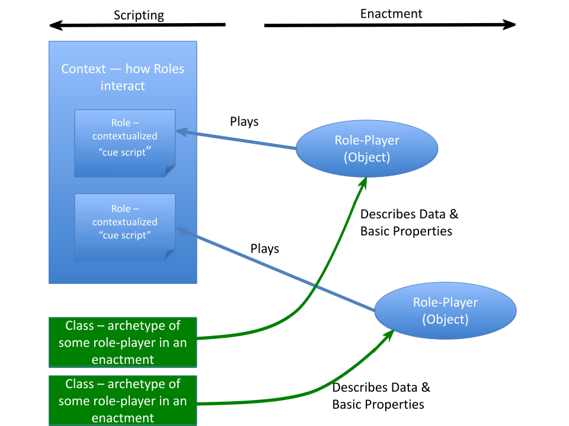
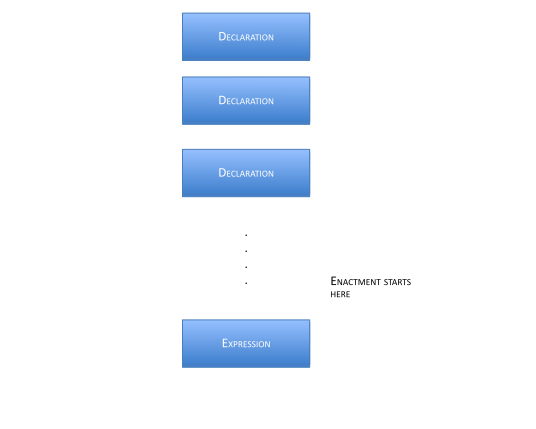
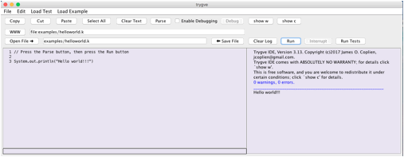
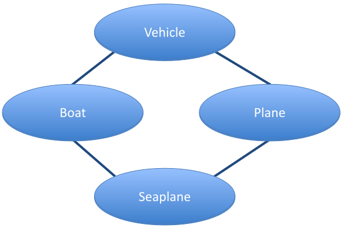
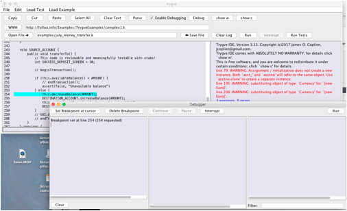
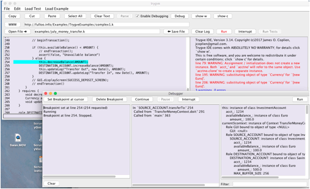

# trygve

an overview

James O. Coplien<br>
Winter 2022

# 1. The What and Why of **trygve**

Programming is always about producing illusions through a reality that the programmer creates in a computer and between a computer and a human being. We can profitably use some of these illusions, but many of them must fight through layers of history and prejudice to touch anything deep inside the end user, or her surrogate, the "programmer." Much of what we know about programming gets in the way of engagement between end users and the objects with which they playfully interact to achieve some task. For example, while end users think in objects, we script execution in classes. While end users think in scenarios and problem-solving approaches, we focus on individual methods and on the state of individual objects.

To get the most enjoyment from this tutorial reference you might best willfully suspend your disbelief and forget much of what you think you know about programming. The **trygve** (pronounced ˌtɾyɡ' ʋə) language is in some sense designed for a child-like mentality that hasn't yet been polluted by computer science, but which retains problem-solving skills that children exercise through eyes that see the world in a less stilted way than a programmer does. The approach took its original inspiration from what we can glean from Alan Kay's early ideas of how his vision of the Dynabook computer could aid children in what we can refer to in vulgar terms as _learning_, but which entails much more, to the point of thinking of the machine as an extension of self.

The **trygve** language allows you to think about your program in terms of mental models of some phenomenon that you bring to the table. It's called object-oriented programming, so we're going to talk about classes as a supporting cast rather than as the star players. Here, objects are the stars of the show. We talk about objects in terms of the names our compressed mental models give them as they interact to solve some problem. Those names are Roles. Any given Role is just a name but at the same time is much more. The Role _fireman_ is just a name for some human being in a particular Context, but it also elicits a host of associated behaviors. Those behaviors that are germane to the Role itself, without much regard for the Role-player, are called _scripts_ in **trygve** (computer scientists call them _methods_) — little recipes for doing very small tasks.

While Roles link to the left brain, classes link to the right brain. We filter billions of bits of information in the world around us to make sense of it, and our massively parallel right brain is really good at doing that. We use classification to compress the common aspects of many related objects into one concept. Though we see Hamlet a 100 times we know just a single script. We may start by organizing our world into classes, which will provide the basic building blocks of local state and ways of interacting with that state.

Programming becomes an act of script-writing. A "program' in the sense that we usually use the term, for the source code, isn't the real program at all — it's just the script that the enactment will follow. The **trygve** language is designed to reduce the transition from run-time to scripting and back again. The "programmer's" mental model should be focused on the action and, in particular, on the interaction between the end-user and the objects which represent that user's interests inside the machine.

The **trygve** language syntax takes a cue from Java syntax mainly for reasons of broad familiarity. With the Java legacy comes a legacy of arithmetic types — to a Martian, it would seem that all programmers are working in the domain of mathematics. The fantasies of academia aside, it simply isn't so. Very few computers compute — i.e., very few of them produce an "answer" or "result." They run machinery, fly planes, process telephone calls, with any of the numbers of those domains playing only an incidental part in the structure of the program.

But **trygve** departs from Java in many subtle ways. You can write Java in any programming language, and **trygve** is very accommodating for those who prefer Java syntax. But experience with the language will help you discover that it has a few features that make it feel at times like Erlang, and at times like Ruby, or maybe some other language that has graced your programming history.

And **trygve** departs from Java in yet more fundamental ways. Java tried to be a pure OO language by outlawing global functions, but that is a simplistic hope at best. It ended being only a class-oriented programming language. Like most languages of its kind it has many features to finesse class relationships. These features encourage class-oriented thinking, overuse of inheritance, and programmer convenience over end-user mental models. So you will find neither friends, or static objects, or the concept of super, nor the protected access property in **trygve**.

The **trygve** language is just one part of a system design that supports end user mental models. In the end, **trygve**'s main contribution is to the left-brained side of computation — the enactment of scripts. Users still engage their right brain during program enactment but in modern computing, such activity is usually associated with the visual cortex. Identifying the right entities (objects) happens on the screen, and Model-View Controller (MVC) has been designed as the bridge between end user and computer in that regard. MVC and **trygve** can powerfully be combined to provide the most expressive links between the end user and the machine.

# 2. Enactment Building Blocks

The **trygve** language, as a language, has its writings appear on two-dimensional surfaces such as your computer screen or a sheet of paper. We usually call this sequence of characters a program. In **trygve** we call it a _script_, to evoke a metaphor of theatre with a lot going on in the framework of defined Roles. The **trygve** environment is designed to help you think about what exists and happens during the enactment of the script — the actual performance of the play. The program that you write in **trygve** is a set of instructions for bringing about a certain enactment. The script describes what can happen at run time and, in many instances, describes the ordering constraints on run-time activities.

The main run-time building blocks are called _objects_. Each object works with other objects to solve some business problem together. We adopt this model in contrast to letting one method use the objects and their services as slaves, orchestrating them to achieve some outcome. We instead push the interaction control into the objects. Nonetheless, we maintain the code for these slices of control in one administrative entity called a Context, on a per-use-case basis.

Objects exist only during script enactment (in computing terms, when we are "running the program"). Each one carries out the work that it "knows" how to do, and the sum of all the small activities from individual objects add up to a fully performing program.

These smaller activities that take place inside objects are small scripts in their own right so we call them scripts, too. In the programming vernacular they are called _methods_: a kind of prescription for a way of doing something. Here is a **trygve** script for computing the factorial of an integer n:

```java
int fact(int n) {
  return if (n <= 1) 1 else n * fact(n-1)
}
```

Each object has the ability to run one of its scripts at a time. At a low level a script is a collection of expressions that are enacted in a specified order.

(Actually, if you use **trygve** primitives like `read` that cause the current execution of sequence to pause, another activity, such as pressing a key on a keyboard or moving the mouse, may enact another script on the same object. But that is the exceptional case. For more about this, see the documentation on `Panel` and particularly on the `handleEvent` script.)

Though **trygve** supports the illusion that each object has its own copy of its scripts, we need to script the activity only once — in the object's _class_. This is done before program enactment. It will be in classes, and their close cousins Context and Role, where most of the scripting activity takes place. But it's important always to keep in mind that a real program is a living, breathing thing, interacting with a (less metaphorically) living, breathing end user out there. The mindset during scripting should always be in terms of the objects in play and in terms of their interactions with the end user during program enactment.

So we now have the context to move on to scripting.

# 3. Script Building Blocks: Declarations and Expressions

As a problem-solver you will be writing scripts that bring the program and its enactment into being at run time. These scripts are the two-dimensional text you write on a piece of paper or type into the source window of the **trygve** environment. The **trygve** language is a textual language, mainly because we felt that, for whatever reason, textually based programming languages seem to thrive while graphical programming languages founder or never gain any footing. The most likely reason is that we simply don't yet know how to express complex solutions well in graphical form. Text can be highly expressive, even with a limited vocabulary, because of the meaning that is generated by the sequential arrangement of textual content on a page.

Scripts in **trygve** (the **trygve** source language constructs) have two basic building blocks:

- Declarations
- Expressions

There is no concept of 'statement' in **trygve**. _Declarations_ are the foundation and the scaffolding for your program, and _expressions_ are the things you write to instruct your program how to do stuff. Declarations include, for example:

- Classes — A class specifies the makeup of an object and is the place where we write the basic scripts to interact with the state of that object. We say that an object is an _instance_ of its class. The class captures the properties of some concept from our business, where that object corresponds to something we name, manipulate, or manage in the real world. We can use a class to describe the concept of a rectangle in the domain of geometry:
```java
class Rectangle {
  public double area() { return height_ * width_; }
  public Point center() {
    return new Point(upperLeft_.x() + lowerRight_.x() / 2,
                     upperLeft_.y() + lowerRight_.y() / 2);
  }
  . . . .
  Point upperLeft_, lowerRight_;
  double height_, width_;
}
```
    This class happens to contain the scripts `area` and `center`, and also includes declarations for the data `height_` and `width_`. Data are how we remember stuff. Data encode information that is important to support our problem-solving; how they encode it should be of no concern to the user of the enclosing object. The representation, or encoding, of information as data is encapsulated inside of a class, and the users of the corresponding information interact with the data through the _scripts_ of that class. In the above example, Rectangle is a class — but so are Point and double. We access them through those declarations that it chooses to make public. By the way, a class exists in a condensed and largely hidden form during program enactment.

- Contexts — a Context is a script for a complex set of interactions involving several objects. The overall script is broken down into individual scripts called _Roles_. A given set of objects may play a given set of Roles to enact some system-level script. In computerese we call this higher-level script a _system operation_; the requirements people call it a _system_ _use case_. This level of enactment is akin to a scene in a play. Like a scene in a play, a given Context enactment has a beginning and an end (though in theory a given system operation — or a play — could go on forever).
- Roles — A Role is the script for an object participating in a particular system operation or 'scene.' Roles exist only inside Context scripts. Each object participating in a given Context enactment (system operation) 'knows' how to play its Role. Role-playing knowledge is bestowed on an object when it becomes engaged in a Context script, and it forgets all of that Role-playing ability at the close of the Context action. A Role comprises _scripts_ which an object enacts when receiving a cue from another Role; that object in turn can elect to send cues to one or more objects that are also playing Roles within the same Context. An object playing a Role is called that Role's _role-player_.
- Scripts are like the lines spoken by a given role-player. A script is a collection of expressions, and possibly supporting declarations, that describe how it carries out its part of a dialogue that is elicited by a cue from another object. Most Roles have multiple scripts, just as a Role in a play may speak and do several things in a given scene of a play.

Declarations may use expressions, as well as other declarations, as building blocks. (The same is true for expressions in that they may use declarations as well as other expressions as building blocks.)

Expressions include, for example,

- Arithmetic and boolean computations (addition, comparison, etc.)
- Cueing another object (the way we script interaction between objects)

A **trygve** program comprises a list of declarations followed by a single expression (though that expression may be quite elaborate). Enactment starts with the evaluation of that expression. Of course, that expression interacts with the preceding declarations, and a large, complex enactment may unfold from these interactions.





# 4. Scripts

You write a script to orchestrate the solving of your business problem. A script is a sequence of Declarations followed by a single Expression that kicks things off — usually by interacting with the expressions in the Declarations. A very simple program may not have any programmer-supplied declarations at all but only an expression. So this is a perfectly good, complete **trygve** program:

```java
System.out.println("Hello World")
```

This expression uses a built-in declaration of class System that lives inside the **trygve** environment, which publishes an interface to an object called out that programs can use to send output to the user. The object can be asked (we always _ask_ objects — never _tell_ them) to evaluate the expressions of its script called `println`. We send along some information in our cue to the `out` object requesting the performance of the built-in `println` script, which is a string that we want `out` to print: 'Hello World'. And `out` will do just that.

Start up the **trygve** environment on your machine. Copy the above script into the text pad (the editing area on the left half of the screen). You can either copy and paste the text or simply type it into the text pad. Or you can select 'Example Text' from the **Edit** menu.

Next, press the **Parse** button. This causes the **trygve** environment to read the script and to "understand" what it is supposed to do. During this process **trygve** will look for errors in your script: it's pretty fussy about the grammar you use. If all is well **trygve** will draw a blue line beneath the welcome message.

Last, touch **Run**. This will cause **trygve** to evaluate the last (and only) expression in your script. The result is that the message 'Hello World' appears on the output pad.



`System.out.println` is one kind of expression. Like all expressions, it can be combined with other expressions into a larger script. Declarations can also be used to group together scripts related to some real-world object, or to group together scripts for a given Role.

## 4.1 Mathematical Expressions

Mathematicians were some of the first programmers and, for better or worse, most contemporary programming languages bear their mark. I remember that when I started studying ancient Hebrew that our instructor advised us that there is really nothing magical about the Hebrew language and that, contrary to belief of some, if wasn't the language spoken by the Deity or anything like that. Computer scientists tend to have the same belief about mathematics: that it is somehow fundamental to what computers were designed to do. In fact, few computers 'compute' (i.e., evaluate formal mathematical expressions to give a certain number or set as a result), but rather serve as a way to extend the user's processing of information. Numeric data have proven themselves over history as a convenient way to represent information. So we might represent a given color as 164 parts red, 210 parts green and 237 parts blue (which represents the color of part of the shape in the header of this page). Since it is useful to have a single common underlying infrastructure that is common across the industry (because of the economies of scale and scope that come with building on a single technology rather than trying to support several technologies in parallel), numbers have found a home in computing. Numbers form the alphabet from which we craft the "words" and, ultimately, the expressions of computation. But we really just use numbers and rarely use mathematics. Mathematics is a language for talking about numbers and, by inference, real-world things that we choose to represent by numbers (such as the size of your paycheck). Here we are not using the language of mathematics, but rather a language called **trygve**. One might use the language of mathematics to talk about **trygve** programs (e.g., to prove that they have certain properties) but we won't do that here.

This is just a long way of saying that 1. We can't avoid dealing with numbers and arithmetic, and 2. There are many **trygve** expressions to talk about ideas from arithmetic. So `1 + 2` is a valid **trygve** expression. As an expression, we can combine it together with our earlier println expression to say:

```java
System.out.println(1 + 2)
```

which of course prints 3. The common arithmetic operators are all there: ­–, *, +, and /. There are also less common binary operators like ** for exponentiation (e.g., 2 ** 30 yields 1073741824) and % for modulus.

You can use parenthesis to group smaller expressions into larger expressions. For example, the expression

```java
(-b + sqrt(b ** 2 – (4.0 * a * c)) ) / (a + a)
```

might be used to find one of the roots of a simple polynomial. The expression `b ** 2` means "raise b to the second power;" `4 * a * c` means to multiply 4 by a, and they to multiply the result by c. Evaluation normally proceeds from left to right (unless your use of parentheses groups expressions differently).

## 4.2 Identifiers

But what are `a`, `b`, and `c`? Expression like the one above became familiar to you if you graduated from arithmetic to algebra. In algebra, we use letters to represent some value that can vary every time we use any given expression. Algebra calls them _variables_. In **trygve** we call them _object identifiers_, or just _identifiers_ for short.

Mathematicians tend to use letters of the alphabet to name numbers (and they'll sometimes use a variety of alphabets depending on their goal, so you may know, for example). We find single letters a bit boring, so we use ordinary English (or pick your own language: the native **trygve** language is Nordic) words as identifier names. So we might more clearly describe the quadratic formula like this:

```java
(-coefficientOfSecondOrderTerm + sqrt(coefficientOfFirstOrderTerm ** 2 –
  (4.0 * coefficientOfFirstOrderTerm * constant)) ) /
  (coefficientOfFirstOrderTerm + coefficientOfFirstOrderTerm )
```

This looks long and you probably are thinking that it's too much typing. However, programs are read dozens of time for each time you write them, and we want code to be above all understandable, even by those who didn't write the code.

An identifier is a name for an object. Identifiers behave like PostIt® notes that can be affixed to objects. We associate an identifier with an object like this:

```java
a = 1
```

This creates a PostIt note with '`a`' written on it and affixes it to the object for which _1_ is the symbol. _1_ is just a symbol in the **trygve** language that represents a very simple mathematical object. _2_ is another symbol that represents another object. These two objects are similar in many ways: they can be added and multiplied in the same ways, and the 'things we can do to them' are the same (all the abelian operators). These objects belong with each other, and many others, as members of a set: the set of _integers_.

By the way, if we say:

```java
b = a
````

then both `b` and `a` end being names for the same object. If we then say:

```java
b = 2
````

then `b` ceases to be a name for the object represented by the symbol _1_ and becomes a name for the object for which _2_ is the symbol. The identifier `a` persists as a name for the object representing the integer _1_.

If you want to know whether two identifiers name the same object, you can ask:

```java
if (b is a) System.out.println("b and a are the same object")
```

This is a different thing than asking whether two objects have "the same value." We write that like this:

```java
if (b == a) System.out.println("b and a have the same value")
```

What "have the same value" means varies from type to type and usually matches intuition. If we wrote:

```java
a = 1
b = 1
```

most people would agree that `a` and `b` have the same value; however, the are _not_ the same object. That is:

```java
int a, b
a = 1, b = 1
System.out.println(a == b)
System.out.println(a != b)
System.out.println(a is b)
System.out.println(a is not b)
```

will print:

```java
true
false
false
true
```

Compare that with:

```java
int a, b
a = 1, b = a
System.out.println(a == b)
System.out.println(a != b)
System.out.println(a is b)
System.out.println(a is not b)
```

which will print:

```java
true
false
true
false
```

Most identifiers start being associated with the value null when you declare them but before you initialize them or assign to them. You can check if an identifier has been bound to an object with the expression:

```java
objectName is null
```

and you can associate a name with the null value by saying

```java
objectName = null
```

The expression

```java
objectName == null
```

is also meaningful and gives just about the same result as the expression `objectName is null`.

Expressions become much more powerful when we can write them in terms of identifiers. We'll learn more about identifiers in the next section.

The rest of this paragraph is probably a bit more than most people want or need to know, so you skip ahead to 4.3 if you like. There are longstanding traditions in programming, most notably those that spring from the BCPL-, B- and C- based cultures and from UN*X programming, that leading underscores are reserved for internal and system use. It long predates C++ and is much broader than just C. The same sentiment holds broadly for most Microsoft software and the use of leading underscores is explicitly discouraged in the CLS. It's outright illegal in Delphi (yes, there are still a lot of Delphi programmers, particularly in the Balkans).

I don't want **trygve** code to look too much like computer code — at least to the extent that is possible within Java confines.

There are tougher restrictions on **trygve** identifier names that are somewhat more conventional. Many internal **trygve** variables use embedded '$' characters. In one case, I use a leading space (the name of the class from which Class is instantiated starts with a space, as I recall). The lexical analyzer doesn't accept any of these so it's impossible to alias internal program names.

There are other restrictions on naming, but that's an Easter egg and I'm going to leave it to others to discover. No fair looking at the code!

## 4.3 Types and Simple Declarations

The **trygve** language knows about a small number of sets, including the set of integers. We have a name for this set, which is `Integer`. (We can also use the shorter name `int` for historical reasons, and that is the preferred usage). Instead of using the word 'set' when we talk about **trygve** programs, we use the word _type_. This word (in English) emphasizes that its members share similar characteristics. We use types to constrain the kinds of objects that identifiers can associate with, like this:

```java
Integer a, b
```

`Integer` is a type. This code tells **trygve** that the identifiers a and b may be associated only with `Integer` objects. This helps **trygve** help you keep things straight in a program. The **trygve** language also understands the additional small set of types `String`, `double`, and `boolean`, and a few others. Some of them are described in the appendices.

The above line of code is called a _declaration_. Declarations join _expressions_ as one of the major building blocks of **trygve** scripts. By itself, a simple declaration doesn't do any work or run any script. It doesn't create any objects. It takes no memory in the machine. It merely "declares" some properties of its identifiers, for future use. You must declare an identifier before using it: Within a script the declaration for an identifier _usually_ must appear before its use. In general, it's a good idea always to have the declaration for an identifier appear above its use within a script. Longstanding tradition holds that the declarations within classes (and analogous declarations like Contexts and Roles) put the public, published declarations at the top, because those are of most interest to the common reader of the code. However the **trygve** language is flexible for some declarations and may allow them to come out of order. We'll see some examples later.

## 4.4 Objects

Objects are the key building blocks of a running **trygve** program. The **trygve** scripts bring objects into existence and the objects can have access to each other, to invoke each other's scripts, to achieve some overall business goal.

For you computer scientists: you're probably thinking that I misspoke about _1_ when I used the word _object_, because most programming languages distinguish between objects and values. The **trygve** language does not cling to any such distinction because, for all practical purposes, it deals only with objects. There is only one value in the **trygve** language, which is `null`, and we'll talk more about it later. In short, it is the object that is no object.

Objects are agents inside our program that can do basic, simple, local computations. They are like individual actors that we hire if we are producing a play. Individually an actor may not be able to do much that is impressive, but several actors exchanging lines and working in concert can rise to complex action.

An object has three distinguishing properties. The first is behavior. An object is a locus of related behaviors that together model the behaviors of a concept that is part of our model of the world. So an object in our program helps us use the computer to extend the processing of our brain according to how we program it. We implement an object's behaviors as a collection of scripts. Each script has a name and a few other properties that help us to use it in a flexible way.

The second is state. When a script executes in an object it usually changes the object state. For example, if we have an object that represents a triangle on a plane, and the object executes its `moveTo` script, the object's location changes. If the object is charged with 'knowing' its location we say that location is part of its state. State has meaning only under the possibility of change. An object's state is usually implemented in a specific small collection of computer data that are allocated when an object comes into existence.

The third is identity. If an object exists and we associate an identifier with it, and then associate another identifier with the same object, then we can send a cue to that object through either of those identifiers and the end result will be the same.

When the symbol 1 appears in a **trygve** program, the program creates a new object representing the integer value 1. So the statement:

```java
a = 1
```

first creates an object representing the object 1, and then associates it with the identifier `a`.

## 4.5 Classes, Scripts and Cues

We have talked about the type `Integer`. `Integer` has its own predefined scripts for adding, subtracting, multiplying, and dividing numbers, and maybe a few other arithmetic tasks. Each `Integer` has its own data to store its state. Someone has written the code for `Integer`. The construct that holds that code is called a _class_. 

A _class_ is a concrete implementation of a type. Classes are the most common building blocks of **trygve** scripts. We think objects and write classes and Roles. A class looks like this:

```java
class ClassMate {
  public String familyName() {
    return familyName_;
  }

  public String firstName() {
    return firstName_;
  }

  public String nickName() {
    return nickName_;
  }

  public int age() {
    Date today = new Date();
    return today.getYear() – birthYear_;
  }

  private int birthYear_;
  private String familyName_, firstName_, nickname_;
}
```

We usually capitalize class names. This simple class represents one of any of our classmates. Its scripts so far are very simple, just giving us some insight into the data used to represent the information in the class's state. Good classes are simple — and dumb.

A class is the DNA of an object. If an object is like an actor, the class is what gives it is basic, simple functionality. All new objects are created with the 'DNA' of their class. That DNA includes the general structure of the object as well as all of its scripts.

### 4.5.1 State declarations

Before talking about the class's scripts, let's look at its description of _state_. The class has declared three identifiers: `birthYear_`, `familyName_`, and `firstName_`. These identifiers can each be associated with an object. (In a bit we'll describe a convenient way to set up the associations between these identifiers and their objects). Note that each name ends with an underscore: a convenient convention. Each declaration gives its identifier a type. In this case all the identifiers are declared with a `private` attribute. That means that they are private to `ClassMate`. They may be accessed only by the scripts inside of `ClassMate`: as far as any external script is concerned, these identifiers don't exist.

The name attributes `familyName_`, `firstName_`, and `nickName_` are all names of objects of class `String`. A `String` holds a sequence of characters that we usually associate with text that can appear on a screen or on a printed page. Its contents are the closest we get to an object that can be "digested" by human senses (though we still need the machinery inside the computer to make the object visible on the screen or on the page — but that's just part of the machine, and it's the same for all programming languages). You can't read an `Integer` — it's just a mathematical concept, and the machine may choose to internally represent it in binary-coded decimal, in binary, or in a more efficient representation like ternary. But we should leave those matters to the machine. Therefore, like most other built-in types, `Integer` provides a way for us to convert it into something more digestible by humans: a `String`. We do this with the `toString` script inside `Integer`:

```java
Integer i = 123;
String s = i.toString();
System.out.println(s)
```

Note that if we just say:

```java
System.out.println(i)
```

we get the same result; that's because `println` automatically applies the `toString` script for us so it can display it on output. The `println` script does this for all built-in types. When you define your own types (we'll talk about that later) you should usually include a `toString` script as part of your implementation.

These lines declare and define the script `familyName`:

```java
public String familyName() {
  return familyName_;
}
```

Altogether, this is another kind of declaration. This declaration describes a script (which doesn't do much). In computerese these are called _methods_. We declare the script as public, meaning that any other code that has access to an object of class `ClassMate` is allowed to ask that the script be run.

### 4.5.2 Script declarations

A script declaration typically starts with a `public` or `private` access modifier, followed by the type of the object that the script delivers back to the client when it is done. (If the script provides no value in return for the cue, then we use the type "void" here). Then comes the name of the script, followed by a pair of parenthesis whose importance will soon become apparent. Then comes the real script: the collection of expressions that the script will execute. These expressions are grouped together inside a pair of curly braces. The lines between any pair of curly braces together are called a _block_ of code. The main block for a script is called the script's _body_.

The `familyName` script belongs to the class `ClassMate`: we think of it as being replicated _inside_ of each `ClassMate` object. We think of every `ClassMate` object as having the ability to run the `familyName` script; because it's `public`, anyone with a handle on a `ClassMate` object can cue the `familyName` script to be enacted. While it is being enacted we think of the action happening inside the `ClassMate` object. Inside the object we find other scripts as well as identifiers that have become associated with other objects. We see the `familyName` script refer to the identifier `familyName_` (note the trailing underscore — a manually maintained convention for naming identifiers that belong to an object, and which are declared in those objects' class). Because the `familyName` script is "running inside the object" and because the identifier `familyName_` is also inside the object, the script can just casually invoke the identifier name to interact with the object for which it is a name. The same would be true for `birthYear_`. And the same would be true if one method wanted to cue another method within the same object.

Let's assume that some client of `ClassMate` has become a client by somehow receiving an object of class `ClassMate`. It associates that object with the identifier `studyPartner`. That client can ask the `ClassMate` object to run its `familyName` script like this:

```java
// cue the study partner
String familyNameOfMyStudyPartner = studyPartner.familyName();
```

The `familyName` script is written to return an object to the one who cued it. Here, the code cueing the script binds that returned object to the identifier `familyNameOfMyStudyPartner`. Because we don't need to send any specific objects to the script (there is nothing inside the "()" part of the invocation) we can alternatively write:

```java
// cue the study partner
String familyNameOfMyStudyPartner = studyPartner.familyName;
```

(You can omit the parentheses only in cases where it doesn't lead to ambiguity, and, unfortunately, that isn't always the case.) We say that the client _sends a cue_ to `studyPartner` requesting that it perform its `familyName` script. This is reminiscent of players in a play saying their piece or performing some action in response to some words or action directed to them from some other actor on the stage. In computerese, what we here call a _cue_ is called a _message_. In this example, the `studyPartner` object (of class `ClassMate`) runs its script — which in this case is very simple. When the script runs it takes the object that was previously associated with its local identifier `familyName_` (identifiers local to a class usually end in an underscore, but that is only a convention) and 'returns' it to the client. The return expression delivers the object to the client in the place where the cue appears in the code. In this example, the identifier `familyNameOfMyStudyPartner` in the client also becomes bound to the same object that `ClassMate` had already bound to its `familyName_` identifier. So `familyNameOfMyStudyPartner` and `familyName_` are now both names for the same object.

Most of the other scripts for `ClassMate` are similar — they serve just to give information to some client. The age script actually needs to do some work — a simple arithmetic calculation. `Date` is another class that knows, obviously, about dates. We can create a `Date` object like this:

```java
Date today = new Date();
```

The text `new Date` is an expression whose result is a new `Date` object. That expression can be used anywhere in the program where a `Date` object is expected. Here, we also declare the identifier today and we associate today with the new object, as a means for asking the object to run its scripts. We can cue the new object to give us the current year:

```java
int thisYear = today.getYear();
```

### 4.5.3 Constructors and Method Parameters

You are probably wondering how and when the identifiers `birthYear_`, `familyName_` and `firstName_` first become associated with an object. They are declared `private` and are inside `ClassMate` so they are inaccessible to the outside world. We need to add a new script to initialize the object, so that these identifiers are all bound to objects. This script is called a _constructor_. We can recognize a constructor because the script name is the same as the class name:

```java
class ClassMate {
  public ClassMate() {
    familyName_ = "Smith";
    firstName_ = "John";
    birthYear_ = 2000
  }  
  . . . .
```

Of course, it would be a boring world if all of our classmates where named John Smith. So we allow the client to send information along with their cue to create a new `ClassMate` object — information about the individual for whom the object is being created. Like other scripts, constructor scripts are allowed to have parameters. A declaration of a constructor script with parameters looks like this:

```java
class ClassMate {
  public ClassMate(String familyName, String firstName, int birthYear) {
    familyName_ = familyName;
    firstName_ = firstName;
    birthYear_ = birthYear
  }
  . . . .
```

That is, the method declaration starts with a list of parameter declarations, separated by commas and enclosed in those parentheses you've been wondering about. (The syntax is supposed to be reminiscent of the way mathematicians write functions with their arguments.) We send a cue to create a new `ClassMate` object and to enact this initialization script by saying:

```java
ClassMate someClassMate = new ClassMate("Lastname", "firstname", 1975);
```

Of course, we need only bind those identifiers that we think need to be handled when the `ClassMate` object comes into being; maybe the rest can be bound later by other scripts. However, it is usually good practice to bind all of a class's identifiers to some object inside the constructor.

Putting it all together, we can make a complete running program using the `ClassMate` class:

```java
class ClassMate {
  public ClassMate(String familyName, String firstName, int birthYear) {
    familyName_ = familyName;
    firstName_ = firstName;
    birthYear_ = birthYear
  }
  public String familyName() {
    return familyName_
  }
  public String firstName() {
    return firstName_
  }
  public String nickName() {
    return nickName_
  }
  public int age() {
    Date today = new Date();
    return today.getYear() - birthYear_
  }
  private int birthYear_;
  private String familyName_, firstName_, nickname_
}

{
  ClassMate myStudyPartner = new ClassMate("Funch", "Rune", 1975);
  String familyNameOfMyStudyPartner = myStudyPartner.familyName();
  System.out.print("Family name of my study partner is ")
    .print(familyNameOfMyStudyPartner);
  System.out.print(", age of ").println(myStudyPartner.age())
}
```

This is actually a pretty serious program! The last six lines of the program form a block, and a block is just another kind of expression. Since it is the last expression in the program, it is where **trygve** starts enactment. Computer people sometimes call this the 'main program.' It should be very small and tidy — just enough to kick off execution, so the rest of the objects can get about working together to perform the overall pattern of system enactment.

This program also does a bit of showing off with respect to how we can chain together `print` and `println` requests. `System.out` is just a special object of class `OutputStream` ("special" in the sense that, at this writing, you cannot create your own objects of this class). The scripts `OutputStream.print` and `OutputStream.println` both return the output stream for which they were called. So `System.out.print(123)` is an expression that evaluates to `System.out`. That means we can say `(System.out.print(123)).print(456)` to print 123456. Or we can omit the parenthesis and just write `System.out.print(123).print(456)` to save some typing.

### 4.5.4 Scripts at several levels

You'll notice that the above program has several scripts that we can see inside class `ClassMate`, as well as the final script that starts things off. These are the two most common kinds of **trygve** scripts. Most **trygve** scripts live inside a class and become available to users of objects of that class.

We'll later learn about other concepts which, like classes, group scripts together, sometimes with data and sometimes not. These concepts are:

- The Context, which represents a graph of interactions between objects

- Roles, which contain scripts for archetypes that we carry around in our head

- Interfaces, which are just a way of grouping classes with similar behaviour

### 4.5.5 Identifiers Inside a Script

A script can declare its own identifiers for its own use, inaccessible to any other code. The script can associate these identifiers with the objects passed as parameters, with objects that are returned when cueing other scripts, or with objects that the script creates.

We might create a script to evaluate one of the roots of a simple polynomial. To make the code easier to understand we can break the evaluation into parts. We can declare an identifier for each one of the sub-expressions and combine them into an answer:

```java
double polyRoot(double a, double b, double c) {
  double four_a_c = 4.0 * a * c;
  double denominator = a + a;
  double rootArg = b ** 2 – four_a_c;
  double root = (-b + Math.sqrt(rootArg)) / denominator;
  return root
}
```

As we showed above, we can put several scripts inside of a class. We can break down the polynomial evaluation into small scripts, each one of which contributes its part to the answer:

```java
class Polynomial {
  public Polynomial(double a, double b, double c) {
    a_ = a; b_ = b; c_ = c
  }
  private double four_a_c() {
    return 4.0 * a_ * c_;
  }
  private double denominator() {
    return a_ + a_;
  }
  private double rootArg() {
    return b_ ** 2 – this.four_a_c();
  }
  public double root() {
    return (-b_ + Math.sqrt(this.rootArg())) / this.denominator();
  }
  private double a_, b_, c_;
}
```

First, you'll notice that many of the scripts are declared as `private` — they are private to class Polynomial. That is because they are of no interest or use outside the class. Only other scripts within Polynomial may cue a request to these scripts.

Second, you'll notice that the script called `root` cues two other scripts: `rootArg` and `denominator`. It does so by sending a cue within the same object, which we designate with the identifier `this`. The identifier this is implicitly declared for you by **trygve** within every script, and it always refers to the object containing the script.

## 4.6 Flow Expressions

A script may need to improvise its behavior when it is enacted, perhaps because it has been designed to handle multiple related situations and it has to wait until enactment to know which one applies. This means that we need to be able to steer the flow of expressions during enactment. Or maybe there is some sequence of expressions that we want to do evaluate several times: we want to be able to write it just once but enact it many times, like the chorus of a song.

### 4.6.1 The IF expression

The IF expression lets you ask a yes/no question derived from some state of an object and then to evaluate either one expression or another depending on the answer. So you might write code for a car in China that looks at the license plate number: its oddness `(licenseNumber % 2 == 1)` and the evenness or oddness of the date `(Date.getDate() % 2 == 1)` and to allow the driver to drive only if the evenness of both the date and the license number are the same:

```java
boolean canDrive = if (licenseNumber % 2 == 1)
  Date.getDate() % 2 == 1
else
  Date.getDate() % 2 == 0
```

(Of course, logicians could state this same condition in a much more compact way, but this way is easy to read and helps illustrate what we're trying to demonstrate here.) The IF expression is called a _conditional expression_. It is one of the key building blocks of business logic. Its use also arises in mathematics. Here's an elegant formulation of factorial in **trygve**:

```java
class Fact {
  public int fact(int n) {
    return if (n <= 1) 1 else n * fact(n-1)
  }
}
```

Let's go back to our polynomial roots example. We've already seen the code:

```java
public double root() {
  return (-b_ + Math.sqrt(this.rootArg())) / this.denominator();
}
```

This works as long as `this.rootArg()` is non-negative. If it is negative, then the polynomial has a complex root with an imaginary component.

Instead of writing a script that returns the root to another script in response to a cue, we might instead write a method that just prints both of the roots of the polynomial — including any complex ones.

Let's say that the square root argument is negative: that would cause trygve to encounter the uncomfortable position of trying to take the square root of a negative number, and we want to save it that embarrassment. We'll assume for the time being that we aren't interested in imaginary or complex solutions. We can write:

```java
public void printRoot() {
  double rootArgument = this.rootArg();
  if (rootArgument > 0) {
    System.out.print("root is ")
      .println(-b_ +
        Math.sqrt(rootArgument) / this.denominator())
  } else {
    System.out.println("root is complex")
  }
}
```

#### Side-Effects

Like all expressions the `if` expression yields a result. Like most other expressions, it's a fusion of other expressions working together. We can divide **trygve** expressions into two kinds: those that have _side-effects_, and those that don't. A side-effect is usually a change in some state that persists after the expression has completed its enactment. If one actor in a play just speaks a part, we can't tell by looking at the scene whether that player has spoken that line or not: there is no residual side-effect. But if one player spits at another we can deduce even after-the-fact (at least for a short while) that we had come to that point in the script. The player left a side-effect.

The IF expression is often used for its side-effect alone in many programming languages, and it can be used this way in **trygve**. Let's return to our polynomial example, and revert the printRoot example back to the original version that returned a result.

### 4.6.2 FOR loops and vectors

Sometimes we want to group many items of the same kind together, like a flock of geese or a collection of test scores or a list of attendees at a party. And we may want to enact some script for each of them in turn: e.g., to print an invitation for each of the people we want to invite to the party. If we know the number of items we'll have to deal with, we can use a vector. We can create a vector of `int`s or of `String`s or of `ClassMate`s of a given size.

We must declare a vector before we can use it. A vector of `int`s to hold all the scores from a class test might be declared like this:

```java
int numberOfClassMembers = 23;
int [] scores = new int[numberOfClassMembers]
```

The above vector is called `scores` and has 23 _elements_. Before we arrange otherwise, each element of the vector is associated to the `null` value. Each element of the vector is just a name, and we can associate each of those elements with an object, like this:

```java
int joesScore = 96;
scores[5] = joesScore
```

These expressions first cause `joesScore` to become a name for the `int` object whose value is 96, and then cause `scores[5]`to become another name for that same object. If we had instead said:

```java
int joesScore = 96
int joesIndex = 5
scores[joesIndex] = joesScore
```

the result would be exactly the same: both `scores[5]`and `joesScore`would become names for the same object carrying Joe's score.

Alternatively, we can say

```java
scores.atPut(joesIndex, joesScore)
```

to replace the element at `joesIndex` with the object `joesScore`, and can use

```java
scores.at(joesIndex)
```

as an alternative to `scores[joesIndex]`. This will become useful when we specify a kind of contract for a Role, when we are expecting a vector as a Role-player. Most of the time you'll use the more straightforward, algebraic-like syntax.

We normally "fill up" an entire vector with values before it is used; however, there is nothing in **trygve** that says you must do this. If you do fill up the entire vector, then you can very expressively process each of its elements, one at a time. We do this with another expression called a _for expression_. It looks like this:

```java
for (int aScore : scores) total = total + aScore
```

So, for example, we could compute the average score like this:

```java
int scoreCount = 0
double total = 0
for (int aScore : scores) {
  total = total + aScore
  scoreCount++
}
double averageScore = total / scoreCount
```

The expression `scoreCount++` simply increments the value of `scoreCount` by 1. You notice that we use a `double`instead of an `int` to total the scores. If we had summed them as an integer and then divided by an integer, **trygve** would give us an integer result: we would lose the precision in the fractional part. This follows a common convention used in Java and in most modern programming languages.

There is an alternative form of the `for` expression that isn't limited to working with collections like vectors. It is a general way of running an index over a predefined range with a regular increment, and it looks like this:

```java
for (int i = 0; i <= 22; i++) {
  System.out.print(i)
}
```

This loop will print the integers from 0 to 22 inclusive. It works like this: The `for` statement in this form ties together four expressions:

```
for (initialization expression; test expression; increment expression) body expression
```

The `for` loop starts by evaluating the _initialization expression_. It can be any expression or, as indicated in the above example, it may alternatively even be a declaration. By tradition and convention it declares and initializes a simple integer, often called the _loop variable_. The `for` expression will cause the loop variable to successively take on increasing values so that it can be used, for example, as an index into a vector.

Then the _test expression_ is evaluated. It must evaluate to a boolean result. If the result is false, then the `for` expression is done and enactment will pick up at the next part of the script in the flow. Otherwise, the _body expression_ is evaluated. The body expression is most often a _block_: a sequence of expressions grouped together by surrounding curly braces so that, from the outside, they are all treated as one large expression. Once the _body expression_ has been enacted, the `for` expression evaluates the _increment expression_. Again, this can be any expression, but by tradition and convention it increments the loop variable. Last, we return again to the _test expression_, and the loop continues again through the _body expression_ and _increment expression_ and back again, until the _test expression_ causes the looping to come to an end.

So revisiting the loop from above,

```java
int scoreCount = 0
double total = 0
for (int aScore : scores) {
  total = total + aScore
  scoreCount++
}
double averageScore = total / scoreCount
```

we could just have well have written it like this:

```java
int scoreCount = scores.size()
double total = 0
for (int i = 0; i < scoreCount; i++) {
  total = total + scores[i]
}
double averageScore = total / scoreCount
```

#### A Puzzle

It's perhaps time for a little quiz! Given what you now know about objects and vectors, what is the output of the following program?

```java
class VectorTest {
  public void test() {
    int [] intVector = new int[5];
    for (int i = 0; i < 5; i++) {
      intVector[i] = i
    }
    for (int i = 0; i < 5; i++) {
      System.out.println(intVector[i])
    }
  }
}
(new VectorTest()).test()
```

### 4.6.3 While loops

The `for` loop is just one kind of loop in **trygve**, and there are two others: `while` loops, and `do`/`while` loops. These kinds of loops are all basically the same in how they structure computation; the difference is in the boundary conditions, in relative complexity, and in whether they check for completion at the beginning or the end of the iteration.

The `while` loop is perhaps the simplest kind of loop in **trygve**. Generically, it is of the form:

```
while (condition expression) body expression
```

It works by first evaluating the _condition expression_, which can be any expression that evaluates to a `boolean`. If it evaluates to `false` then enactment continues at whatever expression follows the _body expression_. Otherwise, the _body expression_ is executed once. Then we just start over again, and go back to evaluate the _condition expression_, and then the _body expression_ again if the result evaluates to `true`, and so forth. The iteration stops when then _condition expression_ finally evaluates to `false`.

Note that this implies that the _body expression_ has some side effect on which the _condition expression_ depends; otherwise, you will loop forever!

The `while` loop can be used with any expressions that require doing something again and again. Whereas the `for` loop is usually used when the number of iterations is known ahead of time, the `while` loop is typically used when we can know only just-in-time when we are done.

Consider implementing Newton's Method, which takes an unpredictable number of iterations to find a root (adapted from: http://www.cplusplus.com/forum/general/94191/):

```java
double root(double number, double lower, double upper, double guess) {
  double ACCURACY=0.001;

  if (number < 1) {
    lower = number;
    upper = 1.0
  } else {
    lower = 1.0;
    upper = number
  }

  while ((upper-lower) > ACCURACY) {
    guess = (lower + upper) / 2.0;
    if (guess*guess > number) upper = guess
    else lower = guess;
  }

  return (lower + upper) / 2.0;
}
```

### 4.6.4 Do / While loops

A `do` / `while` loop is like the `while` loop above except that the test expression comes at the end:

```java
do body expression while (condition expression)
```

In a `do` / `while` loop the _body_ _expression_ is always executed at least once. We can use the worst sorting algorithm ever, Bubble Sort, to illustrate (courtesy of [http://www.algolist.net/Algorithms/Sorting/Bubble_sort](http://www.algolist.net/Algorithms/Sorting/Bubble_sort), slightly modified):

```java
public void bubbleSort(int [] array) {
  boolean swapped = true;
  int j = 0;
  int tmp;
  do {
    swapped = false;
    j++;
    for (int i = 0; i < array.size() - j; i++) {
      if (array[i] > array[i + 1]) {
        tmp = array[i];
        array[i] = array[i + 1];
        array[i + 1] = tmp;
        swapped = true
      }
    }                
  } while (swapped)
}
```

### 4.6.5 Exiting a Loop

The **trygve** language lets you jump out of a loop prematurely if you should find the need. The `break` statement causes any looping construct to stop enactment of the loop immediately. Enactment ensues immediately following the loop.

Use `break` statements sparingly. They interrupt the normal flow of execution and can make a program slightly more difficult to comprehend than if they weren't there.

### 4.6.6 Switch Expressions

A `switch` expression is kind of a poor man's table lookup. Here is an example from a program by Andreas Söderlund that uses a switch statement to map a chord name to a position:

```java
public int position() const {
  int pos =
    switch (name()) {
      case "C": 1; break;
      case "C#": 2; break;
      case "Db": 2; break;
      case "D": 3; break;
      case "D#": 4; break;
      case "Eb": 4; break;
      case "E": 5; break;
      case "F": 6; break;
      case "F#": 7; break;
      case "Gb": 7; break;
      case "G": 8; break;
      case "G#": 9; break;
      case "Ab": 9; break;
      case "A": 10; break;
      case "A#": 11; break;
      case "Bb": 11; break;
      case "B": 12; break;
      default: 0; break
    }
}
```

In general the `switch` statement is of the form:

```
switch(switch-expression) {
  case constant: expression
  case constant: expression
  default: expression
}
```

The statement first evaluates the _switch-expression_ to get an object. It then checks each of the _case labels_ (those parts of the above description labeled as _constant_) to look for an exact match. (These `case` labels are just tags in the code: they aren't really "enacted" per se, but just anchor some points at which enactment might ensue, depending on the `switch` value). When it finds a match, it continues enactment with the corresponding _expression_.

Case labels are transparent with respect to enactment: that is, enactment will proceed right through them without doing anything. So to keep the above example from executing every expression we add a `break` expression at the end of each one. This causes enactment to jump out of the `switch` statement and to continue at whatever follows. That means that the above `switch` statement can be made a little less redundant by rewriting it as follows:

```java
public int position() const {
  int pos =
    switch (name()) {
      case "C": 1; break;
      case "C#":
      case "Db": 2; break;
      case "D": 3; break;
      case "D#":
      case "Eb": 4; break;
      case "E": 5; break;
      case "F": 6; break;
      case "F#":
      case "Gb": 7; break;
      case "G": 8; break;
      case "G#":
      case "Ab": 9; break;
      case "A": 10; break;
      case "A#":
      case "Bb": 11; break;
      case "B": 12; break;
      default: 0; break
    }
}
```

Of course, you can use a `switch` expression just for its side effects instead of to generate a value. Again, here we unnecessarily introduce a variable that represents state, when, in fact, this is a table lookup that has no state:

```java
int weekdayIndex(String weekdayName) {
  int retval;
  switch (weekdayName) {
    case "mandag": retval = 1; break;
    case "tirsday": retval = 2; break;
    case "onsdag": retval = 3; break;
    case "torsdag": retval = 4; break;
    case "fredag": retval = 5; break;
    case "lordag": retval = 6; break;
    case "sonday": retval = 7
  }
  return retval;
}
```

The expression `weekdayName` is evaluated and then enactment ensues at the expression matching the `case` label associated with the corresponding value. If none of the values match the expression, you can include a `default` label to catch outliers. If there is no `default` label then the `switch` statement effectively does nothing if no cases match the expression. So in this function, weekends would be caught by the default clause:

```java
int workingDayIndex(String weekdayName) {
  int retval;
  switch (weekdayName) {
    case "mandag": retval = 1; break;
    case "tirsday": retval = 2; break;
    case "onsdag": retval = 3; break;
    case "torsdag": retval = 4; break;
    case "fredag": retval = 5; break;
    default: System.out.print(weekdayName).println(" is not a working day")
  }
  return retval;
}
```

It's always a good idea to include a `default` case! And unless you want to use the `switch` statement just for its side effects, all of the case expressions have to be of the same type (which means that the last expression in each expression list after the `case` label, is of the same type.)

Note that the `switch` statement works a bit different than in most C-based languages. In C, the `case` expressions may be in any enclosed scope of the `switch`. In **trygve** they must be in the scope immediately enclosed by the `switch` expression. Also, C limits the `case` types to `int`s; **trygve** supports a much broader set of types, including `String`s.

# 5. Class-Oriented Programming

The most popular programming languages today include Java, C++ and C#. While most people call most of these object-oriented languages, in fact, one writes objects in none of them. Most of the focus of these languages is on _classes_. (One can view Javascript as a more true object-oriented language, but we won't discuss that in detail here.) Classes go back at least to the Simula 67 programming language which many herald as the first, er, object-oriented programming language.

Classes are an extremely important construct whose main value is to capture the primary structure of a program. In most programming languages, classes are the factories or moulds from which objects are built, and the structure of any given object can be traced to its class. To a first approximation this is true in **trygve**. Classes represent our conceptualization of what the system _is_: they are the building blocks of modern programs. In most languages, they exist in the source code; i.e., classes can exist before you have a running program. In many programming languages (like **trygve**, but unlike C++) these classes live on into run-time.

Classes incorporate many of the building blocks of previous-generation programming languages, combining procedural scripts with declarations into one tidy package where the parts fit well together and build on each other to offer more complex chunks of reasoning than procedures alone can. So if we need a stack, we can actually create a single entity that quacks like a stack, walks like a stack, and flies like a stack. We implement that entity as a class, where the class is the assembly of all of the scripts and declarations we would otherwise use to implement stack functionality in an old language like FORTRAN or Pascal, or in C or some other assembly language.

Classes have a close relationship to another important programming building block called the _abstract data type_, exemplified in a language called Clu. Much of the focus of early C++ work was to provide abstract data types (ADTs) to C programmers. The "abstract" in _abstract data type_ refers to the usual way of articulating them as just a collection of APIs that distanced the client from having to worry about how things were implemented internally. These APIs are like contracts for users of an object.

In some sense ADTs exist only in our mind (or they may show up in system architecture documentation where we want to conceptualize the big pieces). However, like all languages, computing languages should be good at communicating the stuff we care about and work with, so it would be good to be able to actually _write_ an ADT. And in **trygve** we can: the artefact is called an _interface_. **An _interface_ is a contract by which some client uses an object**.

There has been much confusion around this notion over the years. It's important to keep thinking of an abstract data type as something that's kind of abstract: about whose internals we do not have to bother. Of course, there must be something concrete behind that abstraction if we are to execute real programs! Sometimes ideal computer scientists get lost in the abstraction and forget about the need for concrete stuff. And that's what classes are. **Classes are the implementations of abstract data types**.

Let's start concretely and then climb up the abstraction ladder.

## 5.1 A concrete, complex class

Those of you who have started to take algebra know about complex numbers. We can think of a complex number as a number with two parts: a _real part_ and an _imaginary part_. Engineers and other folks in the physical sciences use them to model many physical phenomena. If you don't have experience with complex numbers, for the time being just take our word for it that they're useful and that each one is really two numbers rolled into one.

We can write a class for a complex number like this:

```java
class Complex {
  public Complex(double realPart, double imaginaryPart) {
    this.realPart_ = realPart;
    this.imaginaryPart_ = imaginaryPart
  }
  public Complex(double realPart) {
    realPart_ = realPart; imaginaryPart_ = 0.0
  }
  public Complex() { realPart_ = imaginaryPart_ = 0.0 }
  public Complex +(Complex other) {
    double resultingRealPart = other.realPart() + realPart_;
    double resultingImaginaryPart = other.imaginaryPart() +
    imaginaryPart_;
    Complex retval =
    new Complex(resultingRealPart, resultingImaginaryPart);
    return retval
  }
  . . . .
  public String toString() const { . . . . }
  public double realPart() const { return realPart_ }
  public double imaginaryPart() const { return imaginaryPart_ }

  private double realPart_, imaginaryPart_;
}
```

Most (but not all) class names start with an upper case letter. (The **trygve** language currently does not enforce this but it's good to be attentive to this very common convention.)

### 5.1.1 Classes and Constructors

Let's take apart this class one piece at a time. At the outermost level is a wrapper:

```java
class Complex {
  . . . .
}
```

These lines wrap a declaration, where the declaration, well, _declares_ the class Complex. We fill in the declaration with our instructions to the **trygve** language about what this class should do. The first script is a special script called a _constructor_, and it is used to initialize objects of class Complex:

```java
public Complex(double realPart, double imaginaryPart) {
  this.realPart_ = realPart;
  this.imaginaryPart_ = imaginaryPart
}
```

The **trygve** environment calls this constructor on our behalf when we create new objects of class Complex. You notice that the constructor has two parameters, `realPart` and `imaginaryPart`. We need to supply these parameters when we create the object. We do that like this:

```java
Complex myComplexNumber = new Complex(1.0, -1.0)
```

This will create a new `Complex` object with a real part of 1.0 and an imaginary part of ­–1.0. When we make this enactment request, `realPart` becomes a name for the object representing 1.0 and `imaginaryPart` becomes a name for the object representing -1.0. It remembers these numbers by associating them with identifiers inside `Complex` itself, and we find their declaration at the very bottom of the class:

```java
private double realPart_, imaginaryPart_;
```

You may notice that the declaration is prefixed with the word `private`. This is called an _access modifier_. It controls what scripts can interact with `realPart_`and`imaginaryPart_`. By making these two identifiers `private`we're telling **trygve** that their objects should be accessible only to scripts inside class Complex itself. By the same token you notice that most of the scripts are declared as `public`, which means that the scripts can be enacted by any stakeholder that is using the Complex class.

Back to the constructor — we stored away these parameters by saying:

```java
this.realPart_ = realPart;
this.imaginaryPart_ = imaginaryPart
```

What this means is: "take the object named by `realPart` and also bind it to the `realPart_` identifier that is inside the current object, `this`", and then to do the analogous thing for the `imaginaryPart`. The identifier `this` is always bound to the object to which the current script belongs. When referring to members of the current object we can usually omit it; that is, the above lines could just as well have been written:

```java
realPart_ = realPart;
imaginaryPart_ = imaginaryPart
```

You'll also notice that these identifiers end with an underscore ("_") character. This is a convention used when naming object declarations inside a class; again, it is up to you, and not up to the compiler, whether you want to do this.

Next, we find this script:

```java
public Complex(double realPart) {
  realPart_ = realPart; imaginaryPart_ = 0.0
}
```

It looks a little like the other one but takes only one parameter, which is the real part of the complex number. It is another constructor. This is used if we want to create a complex number whose imaginary part is zero. We can say

```java
Complex myComplexNumber = new Complex(2.0)
```

Of course, this is identical to writing:

```java
Complex myComplexNumber = new Complex(2.0, 0.0)
```

and either is acceptable. And there is a third constructor:

```java
public Complex() { realPart_ = imaginaryPart_ = 0.0 }
```

that just initializes the new complex object with both its real and imaginary parts zeroed out.

Notice that we took great care to initialize the realPart_ and imaginaryPart members of the object inside each of the constructors.

```java
. . . .
public Complex(double realPart) {
  realPart_ = realPart; imaginaryPart_ = 0.0
  }
. . . .
private double realPart_, imaginaryPart_;
```

As a syntactic convenience we can initialize these members in place instead:

```java
. . . .
public Complex(double realPart) {
  realPart_ = realPart;
}
. . . .
private double **realPart_ = 0.0**, **imaginaryPart_ = 0.0**;
```

The initializations actually take place when any constructor is enacted to bring a new object into existence.

### 5.1.2 Teaching the Compiler about New Types

The next script is a bit more interesting:

```java
public Complex +(Complex other) {
    double resultingRealPart = other.realPart() + realPart_;
    double resultingImaginaryPart = other.imaginaryPart() + imaginaryPart_;
    Complex retval = new Complex(resultingRealPart, resultingImaginaryPart);
    return retval
}
```

This script defines what **trygve** should do if we ask a `Complex`object to enact the "+" script. That looks like this:

```java
Complex c1 = new Complex(1.0), c2 = new Complex(2.0);
Complex c3 = c1.+(c2)
```

That would cause the `realPart_` identifier in `c3` (a new object, different from either `c1` or `c2`) to be bound to a `double` object with the value 3.0. Of course, this syntax looks pretty strange and computer-like: we're explicitly calling a script named "+", using the usual notation with a period that we use when enacting other scripts. While this syntax works, **trygve** recongises this equivalent way of saying the same thing:

```java
Complex c1 = new Complex(1.0), c2 = new Complex(2.0);
Complex c3 = c1 + c2
```

which is just how you learned it in algebra class.

There is something fundamental going on here, and it's worth making it explicit. When we're writing code like this, we're teaching the compiler how to recognize new types. The **trygve** environment already recognizes a "+" operator (as well as "-", "*", "/", and a few others) on `int` and `double` types. The compiler-writers baked that into the compiler when they wrote it. Now, **trygve** is giving you a chance to effectively extend the definition of the language. You are teaching the compiler how to work with a new type: `Complex`. It's a type you created. Of course, all the scripts of the Complex class do this in varying degree, but it's all the more obvious here with the ability to redefine the semantics of an ordinary operator. You can't do this with all operators.

You can also change the way that the relational operators (like "<" and "==") work. These operators are special in that there is some redundancy across them. That is, if you know "<" and "==" you can write the code for ">" in terms of those two (if neither "<" nor "==" is true then ">" must be true) and you of course can trivially write the code for "<=". It can be tedious and error-prone to make all of these work consistently — and the consequences of getting it wrong can be very confusing or even disastrous.

So **trygve** takes a simpler approach, inspired by Java. If you have a class for whose objects you want to support these operators, you just give That Class the following script:

```java
public int compareTo(ThatClass other) { . . . . }
```

It is a very simple function: it must return an `int` object and it must take one parameter, which is usually of the same type as the class in which we install it as a script. If `a` is less than `b` and we call a.compareTo(b), it should return -1. If `a` equals `b` then it should return 0. And if `a` is greater than `b` then it should return 1. The **trygve** environment will take care of the rest, and will arrange to call `compareTo` on your behalf when you use any of the built-in relational operators. You can of course enact the `compareTo` script directly. But it is not allowed to define a method whose name is any of the relational operators. We teach the compiler about comparison with the addition of this one simple function: the compiler will guarantee consistency across all the relational operators.

### 5.1.3 Accessors: Everyday scripts

Last, we find some pedestrian scripts that just answer our questions about the values of the real and imaginary parts of the object, or which render the object as a `String`:

```java
public String toString() const { . . . . }
public double realPart() const { return realPart_ }
public double imaginaryPart() const { return imaginaryPart_ }
```

There is nothing mysterious or special about these, except they allow us to access the information hidden away in the objects attached to the `private` identifiers. They are sometimes called _accessors_. You notice that the modifier "const" follows the first part of the declaration. This tells **trygve** that these scripts promise not to modify any of the object state when they execute. Any script may be made `const` but **trygve** will enforce it. You should strive to make as many of your scripts `const` as possible.

You should also make it a habit to include a `toString` script for most classes you write. It comes in handy when you are displaying them for human consumption. Most built-in types have a `toString` script built-in.

## 5.2 An Alternative Implementation of Complex, and Interfaces

Here is another class:

```java
class Complex {
  public Complex(double realPart, double imaginaryPart) {
    theta_ = Math.asin(imaginaryPart / realPart);
    r_ = Math.sqrt(realPart ** 2 + imaginaryPart ** 2)
  }
  public Complex(double realPart) {
    r_ = realPart; theta_ = 0.0
  }
  public Complex() { r_ = theta_ = 0.0 }
  public Complex +(Complex other) {
    double resultingRealPart = other.realPart() + realPart_;
    double resultingImaginaryPart = other.imaginaryPart() + imaginaryPart_;
    Complex retval = new Complex(resultingRealPart, resultingImaginaryPart);
    return retval
  }
  . . . .
  public String toString() const { . . . . }
  public double realPart() const { return r_ * Math.asin(theta_) }
  public double imaginaryPart() const { return r_ * Math.acos(theta_) }

  private double r_, theta_;
}
```

It also implements complex numbers! The first one is often called "Cartesian complex numbers" and this one "polar complex numbers"? Would we ever want to keep both of them around in our library of classes? Maybe. Maybe one or the other would be particularly suitable to some set of algorithms because its approach would prove more efficient than the other. Yet they both faithfully represent complex numbers. From a logical point of view they are completely interchangeable. We say that they are alternative implementations of the type Complex. Remember: a class is an _implementation_ of a type.

Let's say that someone wanted to write some generic code that abstracted away the difference between these two implementations. We make that code dependent on the common interface to these two classes. To that end **trygve** offers a construct called an _interface_, which is a kind of declaration. It looks the `public` bits of the class with all the implementation parts thrown away:

```java
interface Complex {
  public Complex(double realPart, double imaginaryPart);
  public Complex(double realPart);
  public Complex();
  public Complex +(Complex other);
  . . . .
  public double realPart();
  public double imaginaryPart() ;
}
```

The interface will bear the name Complex: it represents the essence of the concept. It is a pure abstract data type. It compiles, but it's really empty — there are no real scripts or declarations here. It is a kind of a contracts that shapes how the implementations must be written.

Given that the name Complex is now taken, we have to rename our two previous attempts. (We were already in trouble because we can't have two classes with the same name at the same level in the same system.) Let's call them `CartesianComplex` and `PolarComplex`. Each one will be rewritten as a new declaration with an explicit allegiance to `Complex`:

```java
class CartesianComplex implements Complex {
  public CartesianComplex(double realPart, double imaginaryPart) {
    realPart_ = realPart;  imaginaryPart_ = imaginaryPart
  }
  . . . .
}

class PolarComplex implements Complex {
  public PolarComplex(double realPart, double imaginaryPart) {
    theta_ = Math.asin(imaginaryPart / realPart);
    r_ = Math.sqrt(realPart ** 2 + imaginaryPart ** 2)
  }
  . . . .
}
```

Somewhere in our code we'll find a client of Complex numbers — in some script of some class. Maybe that method receives a Complex number from one of _its_ clients . We might write the script like this:

```java
class SomeClass {
  public Complex someScript(Complex oneNumber, Complex anotherNumber) {
    Complex retval = oneNumber * anotherNumber + 3.13 * oneNumber;
    return retval;
  }
}
```

The client of this class can choose to work with it in terms of a `CartesianComplex` or a `PolarComplex`, or both, at its whim:

```java
CartesianComplex one = new CartesianComplex(1.0), two = new PolarComplex(2.0)
SomeClass someObject = new SomeClass();
someObject.someScript(one, two)
```

Alternatively, we could have written:

```java
Complex one = new CartesianComplex(1.0), two = new PolarComplex(2.0)
SomeClass someObject = new SomeClass();
someObject.someScript(one, two)
```

So we see that `Complex` works as a generic type. Classes can be used to create types that behave just like the built-in types `int` and `String`, and we can use a class name just about everywhere we can use the name of a "regular" type like `String`. Interfaces can be used to group together alternative class implementations that may be used interchangeably. We can also use interface names just about everywhere that an ordinary type name can appear, with one exception: we can't of course say new InterfaceTypeName.

If you declare that a class implements an `interface`, the **trygve** environment will ensure that it has the right to do so. That is, every script published in the `interface` must also be implemented by the `class`. And only script declarations may appear in the interface — no object declarations!

It's not common, but a class may implement multiple simultaneous interfaces:

```java
class PolarComplex implements Complex, ConvertibleToString {
  . . . .
}
```

This gives the class the ability not only to be used anywhere a `Complex` is expected, but also anywhere any other `ConvertibleToString`is expected. We might have another class which is not a `Complex` but which is a `ConvertibleToString`:

```java
class ClassMate implements ConvertibleToString {
  . . . .
  public String toString() {
    String retval = this.firstName() + " /"" +
    this.nickName() + "/" " +
    this.familyName();
    return retval
  }
}
```

So if we had a `ClassMate` object in hand, and if we add this `toString` script, we could ask the object to run that script to give us a `String` representation of the classmate's name. Maybe in some application we want to keep all of our complex classmates in a vector together with a bunch of `Complex` numbers, to collect all of our "complex" things together, so to speak:

```java
ConvertibleToString [] complexThings = new ConvertibleToString [2];
complexThings[0] = new ClassMate("Smith", "John", 1969);
complexThings[1] = new CartesianComplex(5.0);
```

We could then print out the entire vector, which is now a mixed collection of objects of different classes — but all of _type_ `ConvertibleToString`:

```java
for (String printable : complexThings) System.out.println(printable)
```

### 5.2.1 What is abstraction?

By the way, we used two sophisticated words in the last section — _generic_ and _abstraction_. These two words are often misunderstood.

Abstraction means to simplify by throwing information away. Throwing information away is always dangerous because, most of the time, we need every bit of information we can get! But sometimes too much information is just too much. If you're a manager and you want to know about your employees' progress on some project you probably should be getting regular updates on the coarse, big picture. To look at every facet of every everyday task is called micromanagement. So good managers abstract away the details. To do that takes trust.

If one piece of software trusts another piece of software, it can make the interaction easier to manage by using abstraction. We demarcate a boundary between the two pieces of software (e.g., between a client method and the class of the object from which it is receiving service) with an abstraction boundary. A good class interface is an abstraction boundary, and that boundary is punctured only at the points of `public` declarations. Because it is devoid of any implementation, an interface is an almost perfect abstraction boundary.

If we don't have to care about the details of how classes do their work, then the interface can represent a generic interface to one or more implementations. It not only can better hide the implementation of a single class but can make the differences between several alternative classes transparent. We still get to choose between the implementations (e.g., for engineering reasons) but that decision can be decoupled from the way our code interacts with the "provider of choice." It's like buying generic soap: we care what it does without caring too much about how it was made or who the provider is: yet at some point we make a decision to buy a certain kind of soap, and we are free to change our decision next time. This balance between complete interchangeability, and the techniques that make substitutability transparent, is maybe the central theme of class-oriented and object-oriented programming.

### 5.2.2 Interface Guidelines

Classes, objects, interfaces — so many concepts! There will be more. And we'll return to this topic later to clarify which tool to use when. But it's important at this point to say something about interfaces. Interfaces live in the world of classes and of the major system building blocks. They do not live in the arena of the system's functionality, of its use cases. We have another language facility to cover that: Roles.

So good interfaces organize together classes without regard to the appearance of their objects in use cases. It is a "purely structural" classification. Taking this common engineering rule to heart will make it easier for us all to understand each others' code, and increases the amount of information conveyed by an interface declaration — because we can assume that the designer is trying to use it to organize the classes, rather than to unify any use case logic.

## 5.3 Generic Classes

One of the uglier but most celebrated parts of C++ is its template system. What started as a text-substitution facility to stamp out cookie-cutter clones of a common glob of code eventually made it into the compiler as a language feature. Java adopted this feature and, first, sadly called it "generics," though it is just one form of generic typing, and second, implemented using an approach that suffers from "type erasure" that takes away most of the clever text-substitution power. It has nonetheless become a staple of how Java programmers deal with collections, and we include it in **trygve** for the sake of familiarity. In some sense, it is a poor man's substitute for manually generated broad, shallow inheritance hierarchies.

Generic classes are related to the above discussion of interface. We can use an interface to group together multiple classes whose implementations are wildly different. The interface declaration stipulates the rallying point of what those classes must have in common.

Generic classes are much the same except that the source code for all of the classes is exactly the same. How they differ is in the types of objects they interact with. There are always business needs that arise where we want to capitalize on very low-level commonality between classes, but in a way that would be inconvenient for the programmer to highlight in the code. For example, the `List` generic may care only that its objects all have a `compareTo` operation, yet there may be no guarantee that all such classes adhere to a single industry-standard interface called `Comparable` that ties them together. (Such an interface doesn't historically exist at all in C++ and though the Java library provides such an interface, there is no guarantee that all classes with comparable behaviour pay it homage). So generic classes were created. They allow the compiler to actually analyze the code of the classes that the generic is interacting with and to bind the generic to its client objects at the points where scripts like `compareTo` exist. This made it possible for a single generic class to use classes from several different, uncooperative sources according to their adherence to common conventions, in the absence of the engineering discipline to create type groupings at an industry level or even a project level. Without that discipline it is impossible to leverage interfaces, but generic classes come to the rescue for low-level concerns.

That said, you _can_ use generic classes to express high-level groupings among the classes of a cooperative bunch of good people. However, in that case it's almost always better to use interfaces instead.

So, down to nuts and bolts. The **trygve** environment comes with some built-in generic types, one of which is `List`. One declares and creates `List`s like this:

```java
List<int> intList = new List<int>()
```

Read as a single concept, `List<int>`is a class. As a class it behaves like any other class. There may be another class `List<double>`. However, these two classes have no more to do with each other than class `Apple` and class `Orange`. But the phrase List<int> may be used anywhere a class name may be used.

Though they can't interact in any powerful way at run time, all List classes offer exactly the same set of facilities to the programmer. I can add items to a List:

```java
intList.add(1); intList.add(2)
```

or I can ask its size:

```java
int size = intList.size()
```

or ask for the index of where a given item appears in the List:

```java
int theIndex = intList.indexOf(2)
```

A List is very much like a vector, except it grows at run-time according to need. You can find a more complete description of List and other generic collections in the index. What's important to note here that, as a generic class, List can broaden to handle a wide range of types. So by analogy to the above, we can also write:

```java
List<String> stringList = new List<String>();
stringList.add("one"); stringList.add("two");
int size = intList.size();
int theIndex = intList.indexOf("two")
```

Though this has nothing to do with generics, remember: When using collections like `List`, `Set` and `Map`, that if you are putting any objects of your _own_ classes in them, that your classes should define the `compareTo` operator as a public script. Your `compareTo` will be consulted by scripts such as the `contains` script of `List`, which will compare its argument with every element of the `List` in turn until it finds a match (i.e., your script `compareTo` returns zero, which means value equality. An integer less than zero means that "<" is true, and an integer greater than zero means ">" is true — if they apply). If you do not provide a `compareTo`script then `List`, `Set` and `Map` will use identity comparison for scripts like `contains`, `remove`,`indexOf`, and others (in other words, these scripts will find a match only if it is exactly the same object).

### 5.3.1 Defining generics

**NOTE: We strongly discourage you from creating your own generics.**

You define a generic class like this:

```java
class MyGeneric <Parameter1, Parameter2> {
  . . . .
}
```

The parameters are placeholders for type names that the client will provide. These parameter names can be used within the generic declaration just as other type names may be used:

```java
class MyGeneric <Parameter1, Parameter2> {
  Parameter1 myFunction(Parameter2 foo) {
    Parameter1 retval = new Parameter1(foo.aNumber());
    return retval
  }
}
```

Try doing that in Java.

## 5.4 Inheritance

Inheritance is a relationship between classes. In short, we start with a _base class_ that approximates the result that we want. We create another class called a _derived class_ that describes a delta of additions to the base class to get us where we are going, and we use inheritance to put them together to create a new class (named after the second class) that incorporates an increment of functionality over the original. The syntax looks like this:

```java
class DerivedClass extends BaseClass {
  // the definition of DerivedClass declarations and scripts
}
```

One original purpose of inheritance was to realize code reuse: the derived class "reuses" the code of the base class. However, experience over the years has dampened enthusiasm about inheritance as a reuse feature. First, it's not clear that it's any more powerful as a code reuse mechanism than one procedure reusing the code of another. Second, reuse is first an economic phenomenon and second a technical approach, so something has to be useable (and used) before it can be reused. Good reuse may be a natural consequence of good domain analysis and design, and inheritance plays a very small role in it, if any. Third, inheritance obfuscates code. Even they it did aid reuse, derived classes end buried deep in inheritance hierarchies. Inheritance hierarchies have a habit of becoming unmanageably deep and messy beyond the point of convenient utility. In a nutshell, the preferred approach to code reuse is just to encapsulate an object of one existing class inside of the new one we're building. Generics also had their heyday as a harbinger of code reuse but they jury is out on this. The famous and well-designed Standard Template Library (STL) of C++ has come under attack for not being suitable to the different performance profiles that different applications require.

Fourth, inheritance was originally interwoven with genericity in early OO programming languages. Smalltalk in particular used inheritance as a way of documenting the fact that one object could be generic with respect to another. Base class objects were more generic in that they were less refined, carried less information, and were more general than their derived class counterparts. A derived class object could do anything a base class object could do and, if designed well, could be used anywhere a base class object was expected. So class `Rectangle` might be a generic base class useable by any programmer in the general public, with derived classes `Square` and `GoldenRectangle` for use by ice-cube makers and artists, respectively. This notion of genericity is tied up with how we classify things in the real world, which we want to express in our programs.

Things got out of hand when languages attempted to extend this idea into complex design. Inheritance nominally leads to hierarchical structures, with a root base class at the top with a small collection of derived classes, each of which may (or may not) have its own derived classes, and so forth. A hierarchical organization of classes is equivalent to a Venn diagram with no overlap between circles: only total enclosure of one circle by another. Within an enclosing circle, enclosed circles are disjoint. The problem is that real-world classification is more complex than can be expressed that way, particularly as regards how we organize objects into classes according to their use — i.e., their place in use cases. So if we have the set of Men and set of Women and set of Other, as well as the set of drivers and non-drivers, we cannot reasonably use classes and inheritance to capture our mental model of this system.

The canonical failure mode can be demonstrated with a naive use of inheritance to describe the concepts of Vehicle, Boat, Plane, and SeaPlane:



Let's say that a vehicle must have a registration. How many registrations does a Seaplane have? Well, it might have two: one with the aviation authority and the other with the marine authority. Let's say that a Plane has a seat and a Boat has a seat. How many seats does a Seaplane have? For reasons of this problem (called the "diamond problem" after the rough shape of the graph) and other related problems, multiple inheritance has not thrived. The problem is that each of the parents talks about the inherent properties of the object by which we classify it, rather than talking about the behaviours we can expect from each of these entities which form a strong base for how we classify them. (Children, by the way, are apt to classify things by their properties at an early age. If a child learns that something with four legs is a horse, and the four legs are what make an impression on the child, then the child is apt to also call a dog a horse when seeing it for the first time.)

The world _is_ more complex than hierarchy alone can describe. However, we are trying to view the word in terms of the objects and the external services they provide, rather than attempting to manage our understanding of them in terms of understanding the details of their private innards. We already have a way to organize classes into multiple hierarchies: interfaces. We do not use inheritance for that sort of organization.

What is inheritance good for, then? It's a good question. The **trygve** environment makes limited use of inheritance itself, and it's for the sake of convenient code reuse. There are a few utility scripts like `assert` that live in class `Object`. Every **trygve** class is implicitly derived from class `Object`. This is sometimes useful if we want to manage a collection of totally unrelated things: we can put anything into an object declared as `Set<Object>.`

### 5.4.1 Liskov Subtyping in trygve

Most object-oriented programming languages govern the relationships between methods in a pair of classes related by inheritance, if those methods have the same name. The **trygve** language also has rules governing what is allowed, and what happens when a script is called, when several scripts of the same name appear scattered across the inheritance hierarchy for the object's class.

If there are multiple scripts with the same name, within the same class, then **trygve** selects one whose argument types match those of the caller. This is commonly called _overloading_. If several scripts match, be warned: **trygve** will pick the first match it finds, and the order of consideration is indeterminate. The moral of the story is to make sure that the formal parameters are distinct across each such set of methods: that at least one of the arguments can't be converted to (or from), promoted to (or from) the type of the corresponding (by position) parameter in any other script in that scope that has the same name.

If a script appears in some class interface and another script with the same name appears in that class's base class, we can start to get the power of class-based programming. This is called _overriding_ and the derived class script is said to _override_ the base class version. Normally, these two scripts will have the same parameter list and return type. In that case, when the script is enacted by another object, the most-derived class version wins the bid to handle the request.

It can also work if each parameter of the derived class script is no more specific than the corresponding (by position) parameter in the base class script of the same name. This adheres to what is called the _Liskov substitutability principle_. It allows the user of an object to be able to address that object bound to an identifier declared in terms of any of that object's classes (the class used to instantiate it, or any of its base classes) without the code getting into trouble by asking one of the argument objects to do something that it doesn't know how to do (e.g., because that knowledge would be only in some derived class). This is sometimes called _contravariance_ in computer science lingo.

Using the same reasoning, the type of the object returned by a derived class script must be no _less_ specific than the return type of the corresponding base class script. This is called _covariance_. It is a compile-time error to violate either of these two rules.

The algorithm for script lookup at run time is to start at the derived-most class looking for a match for the message, and step-by-step going up the hierarchy. The compiler guarantees that there will be at least one match at run time.

The only compile-time restriction is that for a pair of classes related by inheritance, that have a contravariant match in any respective pair of signatures with matching method selectors, the return types for the corresponding scripts must be covariant. All other possible relationships are ignored.

Keep it simple, because it's easy to get confused. This code by Matthew Browne is perfectly legal **trygve**, as it follows all the rules. That doesn't mean that it's readable. (What does it print?)

```java
class Base { }
class DerivedA extends Base { }
class DerivedB extends Base { }

class Base2 {
  public void func(Base x) {    
    System.out.println("Base2.func")
  }
}

class Derived2 extends Base2 {
  public void func(DerivedA x) {    
    System.out.println("Derived2.func")
  }
}

class Test {
  public Test(Base2 x) {    
    x.func(new DerivedB())
  }
}

new Test(new Derived2())
```

To belabor the issue a bit further, here is another example worth discussing:

```java
class Animal {}
class Cat extends Animal {}
class Dog extends Animal {}

class AnimalShelter {
  public void putAnimal(Animal a) {
    System.out.println("AnimalShelter.putAnimal");
  }
}

class CatShelter extends AnimalShelter {
  //does *not* override AnimalShelter.putAnimal()
  public void putAnimal(Cat c) {
    System.out.println("CatShelter.putAnimal");
  }
}

class Test {
  public Test(AnimalShelter shelter) {
    shelter.putAnimal(new Dog());
  }
}

new Test(new CatShelter())
```

Writing `CatShelter.putAnimal(Cat c)` is no different than writing `CatShelter.putCat(Cat c)`. Because of the need to maintain Liskov substitutability, neither one of these functions is in any way related to writing `AnimalShelter.putAnimal(Animal a)`. The alternative would be for **trygve** to issue a warning or even an error message for attempting to reuse the `putAnimal` name. But, in fact, this code leads to no undefined behavior: only the potential surprise that putting a cat in a cat shelter, through a generic animal shelter interface, will fail to invoke the CatShelter script.

# 6. Object-Oriented Programming

Object-oriented programming might best be defined as using a network of cooperating objects to solve some problem or produce some result. Earlier definitions of object-orientation were more nerd-based and talked about the paradigm in terms of encapsulation or polymorphism — the main tenets of the technology development of that era. But that is a nerd's perspective, and we want to put more programming power back in the hands of people who use computers to amplify their mental muscles. And if we go back to the earliest foundations of object-orientation in Alan Kay's work, we again see this focus on the human element and on connecting the human mind with the surrounding world.

Even more commonly, people confuse class-oriented programming with object-oriented programming. Class–oriented programming is basically just abstract data types broadened beyond the traditional type realm of languages based on arithmetic and mathematical building blocks. Object-oriented programming is about understanding, modeling, and dovetailing with real-world phenomena such as managing books in a library, controlling an airplane flight, running a telephone switch, or optimizing fuel consumption in a car's fuel injection system. These are characteristic of the areas of the surrounding world into which we wish to extend the human mind. These are complex systems that cannot be appreciated or understood in terms of the properties on classes or the operations, such as inheritance, used to combine classes together. We deal with classes in the dozens; we deal with objects in the thousands.

Let's look at those first words again: "a network of objects working together to solve some problem." (I had originally written "community of objects" which is socially more apt to the sense of the term, but phrase "network of objects" offers better insight into what we need to build to make this happen). It is this network that is the program. Where do you go in your source code to understand the structure of this network? Where do you go in a class to understand the nature of the interaction between its objects and other objects in this network? You don't find this in Java or in C++ or in C# except to the very limited degree that inheritance or templates or generics say something about the composition of minuscule collections of classes or objects working together. And even then, those language constructs rarely answer the interest questions about program execution, about "what will happen next in the program?"

And in most object-oriented languages it is in fact almost impossible to reason, from the source code, about such interactions. The reason is that objects interact with each other with an interaction mechanism that has a built-in wildcarding transfer of control commonly called _polymorphism_. (To be technically correct, polymorphism is much broader than this, and this mechanism is the popular way of implementing one form of polymorphism called _inclusion polymorphism_ by Peter Wegner). If we have a reference to some object, our object can ask that other object to enact a script of a certain name that takes a certain set of arguments. But we do not, from the source code, know for sure what the class of that object will be at run time. We can at best reason one or two steps ahead in execution. What we lose is the _structure of the flow of execution over time_. We know the structure of individual classes, but we cannot reason about the logic of the business-level services that a network of cooperating objects offers to its constituency.

In a nutshell, we don't understand our programs any more. We understand only their parts. In object-oriented programming we need to understand the whole. Our goal with **trygve** is to give a home to the expression of this network of connection between objects and to raise the level of the business logic to the level of that network, instead of burying it in the classes.

The analysis people understood this very early on. UML came on the scene in the 1990s, and Ivar Jacobssen had already developed a vision for use cases. Use cases are what we deliver. People who buy our software rarely buy it according to the classes it contains, but according to the use cases it supports. Modern programming languages haven't caught up. Antique programming languages like FORTRAN took expression of the workflow as their primary expression of structure all along, but the object-oriented pendulum slammed away from this direction in the 1980s, and it kind of stuck over on one side.

The trick is to do so without slicing objects in half — that part that relates to what they _are_, and that part that relates to what they _do_. When we hire an actor to play Hamlet, the actor has certain physical characteristics that owe to his DNA and which _intrinsically_ have nothing in particular to do with being able to play Hamlet. But of course he can't play Hamlet without being able to talk or to hold a skull in his hands, and as an actor, he does this as an integrated being, Indeed, much of the success of good theatre is to support a willful suspension of disbelief so the audience, and even the actor to some degree, believes that the actor actually _is_ Hamlet. Of course, at another level, we know that the Hamlet-ness of the actor lies in a script and his handsome demeanor and booming voice owe to his genes. But when he acts there is a single Hamlet on the stage: not a person with a Hamlet part and a separate I-was-hired-as-the-actor part.

So, on one hand, we have two separable concerns: the DNA of the actor's humanness on one hand, and Shakespear's script on the other. The publishing company has likely extracted all of Hamlet's lines and put them together in a separate little book, together with the cues (lines from other Roles, or happenings on the stage) that will call Hamlet into action. These are called cue scripts and actors find them useful for memorizing their lines.

And so we do it in **trygve**. We have scripts for wonderful plays, such as making a fllght reservation, or transferring money between bank accounts, or planning a release schedule. Each of these scripts is written in terms of Roles that characterize the objects in the network of interacting objects. We have a whole variety of actors suitable to playing those Roles. For the flight reservation system there may be many different sizes and speeds of airplane, and each one may be associated (in its network) with a set of flight schedules that affect its own departures and also those of other airplanes. We have different Roles of people and things who will be on that airplane: pilots, attendants, first class passengers and coach passengers, their luggage, and commercial content that firms are shipping via the common carrier. The Roles, of course, are scripted. Each Role may have one or more scripts. The actors give those scripts life, combine with their own, more humble local scripts for moving their lips and limbs. It is by enabling actors with the appropriate Role scripts that we bring the network of objects to life, and then we say: Lights, Camera, Action!

## 6.1 A caveat, and not throwing the baby out with the bath water

Sometimes class-oriented programming has served us well over the past 30 years; sometimes not. There can be a million differentiating factors, but one of them has to do with the difference between two kinds of business interactions. In one kind of interaction, an end-user poke on a screen causes some very short burst of activity that both the end user and programmer view as atomic. If I'm using a presentation editor, changing the color of a circle I have drawn is an example of such a computation. Writing a whole use case for it is probably overkill: it's simple, understandable, and atomic. Let's in fact call these atomic interactions. They may involve a small number of closely interacting objects.

The other kind of interaction unfolds over time and may entail multiple success computations, decisions, and branches in direction without intervening human interaction. The epitome of such a computation is running a batch program. While we tend to equate batch processing with card readers and the approaches of the 1960s, some major business programs still do account reconciliation as a nightly batch run instead of doing things on the fly. But even in-the-small, some computations entail rather complex algorithms by which a network of objects cooperate to give some result. Simulated annealing is one example. Perhaps making an airline seat reservation is another. These are use cases, and these are where it's important to focus on the interactions between multiple cooperating objects.

## 6.2 Some new programming constructs

If we go back to our "network of objects working together to solve some problem," we find analysis and design concepts that usually cannot be expressed in many programming languages. We give each of these perspectives an articulation in a **trygve** program.

- Use Cases in a **trygve** program are given expression in Contexts. There is usually one Context declaration per use case. A Context realizes a use case through interactions between objects, in terms of the _Roles_ those objects play. A Context implements a special kind of type and in that sense it is in the same category as Classes are. We declare a Context with the `context` keyword in **trygve**.

- Roles in **trygve** both serve as the name of an object (the latter being called the _Role-player_) that plays the Role at run-time, as well as describing the scripts for a given Role. Roles exist only as text in the program; they don't exist at run-time. You will find a Role only as a declaration inside a Context. We declare a Role with the `role` keyword in **trygve**. Roles also look a little like classes except they may contain only script declarations (no objects), just as there are no real people or princes or castles in a _script_ of Hamlet. However, any object can dynamically ingest all the scripts of a Role at run time for the sake of participating in some network of objects in a Context. It is Roles, and they way they interact, that give a Context its structure and meaning. When the Context goes away (the use case comes to an end) the objects forget the scripts from the Roles they were playing; they may come back to play those Roles again, or they may move on to play another Role in another Context.

### 6.2.1 Roles: the heart of what-the-system-does

In a play, a Role is a description of how one of the actors or actresses acts, together with a description of properties of that role (e.g., Hamlet is usually a man and Ophelia usually a woman). Roles define the use case actions in a **trygve** program. Each one can be thought of as a collection of scripts which together define that Role's place in the action. For a Role to be useful, we must "hire an actor or actress" to play that Role. In **trygve**, select objects are be asked to play specific Roles when we enact a use case. An object is called a Role-player in such a capacity. The programmer controls and specifies which objects play which Roles at which time. More on that later.

Roles can be thought of as just special names for objects, with the implication that names have power to convey meaning. So each Role name is annotated with scripts that give the role meaning. Roles are part of how our mental models make sense of the world around us, and they tend to be slightly more general characterizations of objects than we'd find in any single, specific scenario. (Remember, a use case is a _collection_ of _related_ scenarios all compressed together. We'll discuss the _genericity_ of Roles below).

Let's explore a bit further the concept that Roles are a way to name objects. Meaningfully calling someone a Server develops some expectations of what that person is expected to be able to do in a certain Context:

```java
context TakeFoodOrder {
  role Server {
    void explainIngredients() { . . . . }
    void registerOrderForCustomer(MenuItem food, Customer customer) {
      . . . .
    }
    void describeDishOfTheDay() { . . . . }
  }
}
```

This is _my_ mental model of how a Server behaves in the _Context_ of taking a food order. It is a perception; it is not truth. There is no single best way to represent either Roles or Contexts. I happened to write this according to my mental model. In a good software product, the software people will spend a lot of time building consensus in the mental models across all the stakeholders with dialogue and feedback.

Here is another Context in the same domain:

```java
context ServeFood {
  role Server {
    void unfoldAndPlaceServiettes() { . . . . }
    void putFoodOnTable() { . . . . }
    void removeCoversFromFood() { . . . . }
  }
}
```

Notice that again we have the role Server. But this is not the same Server role as was described in the TakeFoodOrder Context. It can be confusing because it's likely _that both Roles are played by the same Role-player_ (let's call him James). But the two Roles are otherwise totally unrelated. They do not interact with each other. They make no assumptions about each other. And in fact they may _not_ be played by the same Role-player.

### 6.2.2 Contexts: The form of function

Roles interact with each other. The interactions form a graph. This graph defines the possible use case interactions between the objects playing the Roles during a given use-case enactment. We gather together connected Roles at the level of their use case, into a programming construct called a _Context_. A Context is the way that we package use cases in **trygve**.

A Context is like a class in many ways: we can use it to create a suitably formed new Context object; it has a constructor, and it has scripts. The Context object stays in existence as long as the use case is running. But a programmer may define Roles only within a Context.

Roles form the bulk of the insides of a Context. The constructor of a Context usually connects each Role-player to the Roles that it will play during the Context lifetime. We associate a Role-player with its Role simply with the "=" operator. Let's take a look at the example we will present in the next section, that of a SpellChecker context. Its main Roles are `Words`, `CurrentWord`, `Dictionary`. The constructor assigns Role players to these Roles:

```java
public SpellCheck(String buffer, OnlineDictionary dictionary) {
  MyScanner parser = new MyScanner();
  Words = parser.wordsFor(buffer);
  CurrentWord = this;
  Dictionary = dictionary
}
```

So, here, we have the `Words` Role being played by an object returned by the script `parser.wordsFor()`; the `CurrentWorld` Role being played by the Context object itself; and the `Dictionary` role played by an object passed to the Context constructor, identified as `dictionary`. Normally, an object may play only one Role at time, just as we would find it awkward, or at least confusing, if the same actor played multiple Roles in a given play. However, if the Role is "inert" — that is, if its Role-player has no state — it is more like scenery which, though it interacts with other Roles in the sense that other Roles can see it (inquire its position, which doesn't change) and walk around it — then that object can play multiple Roles. Roles that are willing to share their Role-player with another Role are called _Stage Props_. Stage Prop scripts may cue only `const` scripts of their Role-player.

It's also technically O.K. for a single object to play multiple Roles within a single enactment of a use case (i.e., inside a single Context instance) because we figure that the person who coded the Context knew what they were doing.

### 6.2.3 Acting In and Out of Character

A Role-player plays a Role in some Context. The Role-player brings its own scripts from its class; it gets new scripts (in addition to the existing ones) when it becomes a Role-player, because it now can perform the Role scripts as well. In a network of interacting objects, Roles usually interact with each other by cueing each other through the Role scripts.

Just as an actress uses her born abilities to carry out the actions in a script, while playing her Role (speaking, moving, crying, fighting, etc.) so a Role in **trygve** depends on the basic stuff in its Role-player to do the actual low-level work. There is a contract between a Role and its Role-player that describes what the Role expects its Role-player to be able to do. This is called the `requires` contract.

So consider a role `PathName`. It may be played by a `String` object. Of course, there are many other objects that could also play the Role of `PathName` as long as each meets the minimal requirements of what the Role methods need. These needs are documented in the `requires` contract.

```java
role PathName {
  public String baseName() {
    String retval = "";
    int baseNameDelim = substring(0).findLast("/");
    retval = if (baseNameDelim == -1) substring(0)
             else substring(baseNameDelim + 1)
    return retval
  }
  public String dirName() { . . . . }
} requires {
  int length();
  String substring(int start, int theEnd)
}
```

This Role publishes only the `baseName` and `dirName` scripts for use by other Role scripts (and Context scripts) within the same Context. Every Role-player must provide the scripts `length` and `substring`. However, another clever Role might know that a given Role-player for _this_ Role can also perform some script X which is not part of the Role itself, but which the object knows how to do because it is of a certain class. We in fact can know what some of these scripts are (without exactly knowing the class) by looking at the `requires` declaration of the Role. So someone might ask for

```java
int l = PathName.length
```

We know that the object has the `length` script so that, in theory, this should work — especially if we're thinking about objects and not classes and Roles. But this is bad form. We want to understand the object interactions in terms of interactions between the Roles, and this is cheating.

If you really, really want to do this, you can tell the compiler that you know what you are doing by pulling the interface of the `length` script up into the Role interface:

```java
role PathName {
  public String baseName() { . . . . }
  public String dirName() { . . . . }
  public int length() // Now public
} requires {
  int length();
  String substring(int start, int theEnd)
}
```

The Role now documents the full API of the object that is used in the graph of computations inside the Context. It is up for the programmer to ensure that the Role-player does something reasonable when `length` is called, because unlike other Role scripts, the source for it is on the other side of some abstraction boundary. We have to reason beyond the assumptions of the object's Role in isolation to consider how the entire Context might interact with this script that is part of the Role-player.

If you want specifically to disallow access of these scripts, change the access modifier to `private`:

```java
role PathName {
  public String baseName() { . . . . }
  public String dirName() { . . . . }
  private int length() // Now private
} requires {
  int length();
  String substring(int start, int theEnd)
}
```

### 6.2.4 More problems with playing multiple Roles at a time

Consider that a Role player is set up to play Role Daniel in the current context called NormalLife. That Context instantiates another Context called the NannySetting. That Context happens to use the same Role-player for a Role named Doubtfire. The nature of a Role is that it can change the state of the object. This raises the possibility that the NormalLife Context might run a script on the NannySetting Context which in turn indirectly modifies the state of the Role player ("indirectly" because the change is hidden from anyone reading the NormalLife Context code). If the NormalLife Context code depends on the state being consistent across its own calls to the `requires` scripts of the Role-player, then there may be unexpected state changes!

We have described how the `stageprop` feature allows one Context to access a Role-player without modifying its state, and usually it's enough to use the `stageprop` feature to give multiple Contexts access to the same Role-player. A `stageprop` can be declared just to use the `const` scripts of the Role-player. However, problems can arise if the two Contexts are somehow tightly linked: for example, if one of them creates the other, and passes the Role-player as the argument that will be bound to the Role in the other. If we trace the path by which the object is handed off from one Context to another, it will be bound to several different identifiers. Those identifiers must be declared in terms of types with compatible sets of scripts: in particular, the `const`-ness must be consistent.

Consider a Context that implements a use case to pay multiple bills from a common account that is bound to the Role `SOURCE_ACCOUNT`. Its `doit` method may look like this:

```java
public void doit() {
  for (Creditor credit : CREDITORS) {
    // Note that here we invoke another Use Case
    TransferMoneyContext xfer = new TransferMoneyContext(
      credit.amountOwed(),
      SOURCE_ACCOUNT,
      credit.account()
    );
    xfer.doit()
  }
}
```

The `SOURCE_ACCOUNT` Role is perhaps declared like this:

```java
role SOURCE_ACCOUNT {
  public String accountID() const;
  public Currency availableBalance() const;
  public void increaseBalance(Currency amount);
  public void decreaseBalance(Currency amount);
  public void updateLog(String message, Date dt, Currency amount)
} requires {
  String accountID() const;
  Currency availableBalance() const;
  void increaseBalance(Currency amount);
  void decreaseBalance(Currency amount);
  void updateLog(String message, Date date, Currency amount)
}
```

The problem is that `increaseBalance` and `decreaseBalance` are non-`const` scripts. The `decreaseBalance` script must be non-`const` for TransferMoneyContext to be able to debit it to pay the bills. But that means that the Role-playing account is playing a Role in the PayBills Context and in each of the `CREDITOR` Contexts — and that will lead to a (non-fatal) run-time error. We could fix this by declaring `decreaseBalance`to be `const`, but it's not. And static type-checking in **trygve** requires that it be declared `const` in all these Contexts if it is declared `const` in any of them!

We want a way to tell **trygve** that though the `decreaseBalance` script is non-`const`, that it doesn't matter in the PayBills script because PayBills in fact doesn't enact the `decreaseBalance` script so there is no danger of having multiple Contexts modifying shared state. We have a keyword, `unused`, that works like `const` in this regard but which can be used to annotate non-`const` methods in a `stageprop` so the language treats them as though they _were_ `const` in that Context. So `SOURCE_ACCOUNT` in PayBillis is declared like this:

```java
stageprop SOURCE_ACCOUNT {
  public String accountID() const;
  public Currency availableBalance() const;
  public void increaseBalance(Currency amount) unused;
  public void decreaseBalance(Currency amount) unused;
  public void updateLog(String message, Date dt, Currency amount) unused
} requires {
  String accountID() const;
  Currency availableBalance() const;
  void increaseBalance(Currency amount);
  void decreaseBalance(Currency amount);
  void updateLog(String message, Date date, Currency amount)
}
```

This allows `SOURCE_ACCOUNT` to be declared as a `stageprop` in PayBills. Each of the `CREDITOR` Contexts (of Context TransferMoneyContext) can bind the same object to a Role (which may also be called SOURCE_ACCOUNT — why not?) where `decreaseBalance` is just an ordinary script that is adorned neither with a `const` nor an `unused` modifier. Since only one Creditor is in existence at any given time (we pay bills one at a time), the Role-player is ever bound to at most one Role — and one `stageprop` as well. There is no danger that one Context can modify the state of a Role-player bound to a Role in another Context.

## 6.3 An example

Let's dive into a longish example that shows off a lot of the **trygve** language, as well as a design using Contexts and Roles. The program is a simple spell checker, inspired by an example from Andreas Soderlund. We start with the domain classes and then move on to the object-oriented stuff.

The domains of the design

| **Domain** | **Description** |
| --- | --- |
| Document | Encapsulates the sequence of words from a manuscript |
| Word | A unit of spell-checkability, but it also includes units of punctuation and spacing |
| Dictionary | The locus of deciding whether a given word is spelled correctly or not, and an oracle that can provide suggested replacements for misspellings |

### 6.3.1 The domain analysis

Before jumping into code it's important to build the foundation. Most object-oriented systems take classes as their foundation. The tradition of modern programming languages has been to combine both the business (use case) logic and "data" into a class, partitioned by one of a number of approaches that were supposed to minimize coupling and maximize cohesion. The problem is that this combination itself destroys both coupling and cohesion right from the start.

So here we start by laying out the cornerstones, the building blocks, for the program. It is akin to getting the materials together for the theatre and hiring the staff for the production of a play. We already know the genre of the play and the setting and maybe even a little of the script. But unlike Shakespearian theatre, we are going to fine-tune the script and continue to evolve it once the infrastructure is in place. It's a little like Dustin Hoffman in "The Holiday," whose serendipitous visit to a movie set caused the producer to write him into the script on the spot, or even more like some movies that are written with a specific actor or actress in mind, like _Django Unchained_ was written explicitly for Christoph Walz or _Lost in Translation_ for Bill Murray.

So if we're writing a spell checker, we'll need a Document to spell check. And we'll need a Dictionary to look up spellings. The Document could be an ordered list of Words, and those, too, will be important building blocks.

All of these concepts arise from casual conversations about spell checking. Each should survive the scrutiny of being a stable, long-term essential ingredient of the domain.

During design these concepts will be mapped onto suitable implementation constructs. For example, the Word will be implemented just as a character range in the Document. The Document will be implemented as a mutable String. The Dictionary will be an interface to a web portal that provides a lookup service. Here, we implement the Dictionary as just a stub that is a simple list of correctly spelled words. If we wanted, we could add some logic to recognize plurals.

### 6.3.2 The narrative and user story

After your domain analysis (or maybe even before) the first thing you might want to write and put in front of the team. A narrative is a _story_. It provides context that might be important for the programmer to know when implementing the program. It needn't be formal or fancy.

> _John is finishing up his term paper for his college history class. He has written a paper on the Myth of the Minotaur, a legendary bull-like beast that was kept by the king of Crete and which has figured both in myth and quasi-historic stories. The main text is in Engllsh but John also uses many words of Greek origin, though he writes in with a Roman alphabet. The paper is about 20 pages long. John wants the paper not to contain any English misspellings and, since he is a native Greek speaker, he is not confident of his English. He knows that he regularly misspells some English words in an inconsistent way (rather than misspelling the same word differently every time). He will be using the word processor that we produce to format his paper, but also wants to spell-check the document he has entered in the basic TextEdit editor on the Mac before converting it to our text editor, because he doesn't want to be embarrassed about misspellings when showing the TextEdit draft to his English wife for her comments. But he'll also want to spell check the final document._

A user story helps us focus on who the stakeholder is and what their motivation is for the software. This is broadly misunderstood. Too often we see user stories like this (this is word-for-word from the requirements of one of our clients):

> _As a user I want a field so that I can enter text._

There is almost no information in that statement. While this one sounds better, it may be even worse:

> _As a student I want to fill out this personal information sheet so I can proceed with the rest of the course registration steps._

You can bet that the student "wants to" do no such thing — the student wants to secure a seat on the course and the preliminary information-gathering step that the registrar put in just gets in the way. It would be better to be honest:

> _As the registrar I want students to complete this information page so I have statistics that can support the funding case I'm taking to the state board._

There we have a business mandate. The first one gives us little insight on how to do the feature right; the second one does.

User stories help the team focus on the stakeholder and his or her motivation. They can be used as the title of a requirement in a product backlog or other document that is used as a foundation for discussion across the whole team but they hardly ever stand on their own.

Together, these preliminary activities prepare us to dig into the scenarios and to discuss how the feature is going to work. We can document our decisions in a use case.

So, for this case:

> _As an author I want a correctly-spelled manuscript_, _so I can give it to others to read without the risk of being embarrassed, or without them misunderstanding what I was trying to say_.

### 6.3.3 The system use case

The use case is the grand script for the play. It describes how the players interact. We cast each of the players into Roles as a locus for related utterances. The individual lines "spoken" by the players are like the cue scripts that actors and actresses use to rehearse their part, while the use case ties them all together.

A use case should always strive towards a goal. The goal of spell checking is to leave a perfectly spelled document. Because human beings make choices along the way — including stopping the use case — we may not achieve that goal, but we start the use case with that goal in mind. The goal should have business value. Because here we are focusing on system use cases, we are a little closer to the implementation and hence are a bit removed from the business use cases where these concerns are paramount. But carry the business use case vision, motivations, goals, and context through to these system use cases.

Because real human beings are involved in a live setting, we can't plan everything perfectly, because there's variation in reality. We _can't_ script real human action. But we _can_ script the common case, and we can capture the most common variations. In the end, of course, it's all deterministic because to deal with every contingency would require a real human being, and we have only the services of a humble robot called a computer. (Too many businesses make a mistake of replacing humans with computers when contingency-handling dominates; for this very reason, Toyota is starting to pull some of its robots off of their assembly lines). But here, we want the computer to augment the human mind by extending its memory (computers are good at remembering data, which can represent important information in the human mind) and at mechanizing repetitive tasks (e.g., there is rarely a need for contingency in adding two numbers, which computers do very well and very fast).

When you discuss the use case, discuss only necessary business sequencing — leave the details up to the programmer, so as to give the programmer the maximum flexibility. For example, for the spell-checking use case, it may not matter in which order the words are checked — whether starting at the back of the document, or the beginning, or in alphabetical order. Here we choose to start from the back of the document and proceed towards the front so that changes don't move the text around the words being checked — the displacement of the word remains constant between the start of the use case and the time when the word is replaced. Good user experience guidance will help you decide what use case sequencing is essential, and which is just an artefact of design.

**Author goal:** A manuscript with perfect spelling

**Preconditions:** The manuscript has been saved and is non-empty

**Post-condition:** Misspelled words have optionally been corrected at the author's discretion. All other manuscript text is intact.

|     | **Author** | **Document** | **Words** | **Word** | **Dictionary** |
| --- | --- | --- | --- | --- | --- |
| 1.  | Ask to spell check a manuscript | Requests that Words build itself from the manuscript |     |     |     |
| 2.  |     |     | Divides the documents into individual Words |     |     |
| 3.  |     | Asks Words to spell-check itself | Asks the current word to spell-check itself |     |     |
| 4.  |     |     |     | Asks Dictionary if it contains the text for my appearance in the document |     |
| 5.  |     |     |     |     | Looks up the word and, if incorrectly spelled, returns a suggested spelling |
| 6.  |     |     |     | Asks the author to validate the spelling |     |
| 7.  | Verifies the suggested spelling |     |     |     |     |
| 8.  |     |     |     | Replaces itself with the suggested word |     |
| 9.  |     |     |     | Asks the next word (if any) to spell-check itself (NOTE: This causes looping back to step 3) |     |
| 10. |     | Deliver corrected document to the author |     |     |     |

**Deviations to the use case:**

|     | **Author** | **Document** |
| --- | --- | --- |
| 4a. | Dictionary does not contain the word | Apply simple rules to strip plural and generative suffixes from the word and try again. Failing this, assume the word is misspelled |
| 6a. | Author doesn't answer "Yes" or "No" | Assume the author has himself or herself provided a substitute word. Verify the substitution with the author |
| 7a. | Author elects to exit spell checking | Spell checking terminates (Do we return the cursor to the location where the author was when initiating spell checking, or to the last substituted word?) |

Remember that a use case _is_ not the requirements, but is just a centerpiece for discussion and a way to document things that the team members (at least you as the programmer, and your end user) have agreed. The real requirements arise in face-to-face dialog that engages all stakeholders.

We divide the use case into the main, everyday scenario, and the variations on that theme. The main use case ("sunny day scenario") appears in the table at the top of this page. It is the most frequent case. Anything that departs from this sequence is a deviation. We need to handle deviations, too, and many of them will be visible from the outset. Yet more deviations will arise during maintenance and program evolution. The use case provides a place to tie together these evolutionary advances with the base scenario that gives them context.

In **trygve**, we'll find that all of the scenarios for a given use case usually live together in one Context where we can reason about them together.

### 6.3.4 Domain Classes

#### OnlineDictionary Class

This class is a simple, small dictionary that is the actual implementation of a dictionary the program will consult to validate word spelling. The heart of the class is a script called `isSpelledOK`:

```java
class OnlineDictionary {
  public boolean isSpelledOK(String word) const {
    boolean retval = false;
    for (String aWord : words_) {
      if (aWord == word) {
        retval = true;
        break
      }
    }
    return retval
  }
}
```

Notice that, unlike in Java, `String` equality comparison uses the common-sense == operator. Note also that we have designated that `isSpelledOK` is a const function: it doesn't modify anything in any existing object, and above all not in the object `this`.

The next method uses a heuristic to find a dictionary entry that closely matches a misspelled word that is supplied as an argument:

```java
public String correctionFor(String word) {
  double winningScore = 0.0;
  int winningIndex = -1;
  int dictSize = words_.size();
  int wordLength = word.length();
  for (int wordIndex = 0; wordIndex < dictSize; wordIndex++) {
    String dictWord = words_.get(wordIndex);
    int dictWordLength = dictWord.length();
    double score = 0.0;
    for (int column = 0; column < wordLength; column++) {
      String c = word.substring(column, column + 1);
      int highestColumnScore = 0;

      // See if c appears in the current dict word. Take a
      // single match (where the columns best align)
      for (int dictWordColumn = 0; dictWordColumn < dictWordLength; dictWordColumn++) {
        if (dictWord.substring(dictWordColumn,dictWordColumn+1) == c) {
          int indexDifference = column - dictWordColumn;
          indexDifference = Math.abs(indexDifference);
          highestColumnScore = Math.max(highestColumnScore, (wordLength - indexDifference))
        }
      }
      score = score + highestColumnScore
    }

    if (score > winningScore) {
      winningScore = score.clone;
      winningIndex = wordIndex.clone
    }
  }
  assert (-1 != winningIndex);
  return words_.get(winningIndex)
}
```

Note that in the assignment of "`winningScore = score.clone;`", we use the `clone` operator to make a copy of the object bound to `score` — otherwise both winningScore and `score` end being bound to the same object. Such aliasing could lead to surprises because modification of the object through one of these identifiers becomes visible in how the same object is accessed through the other identifier.

Last is the constructor, and a simple list of words as the private data of the class:

```java
  public OnlineDictionary() {
    words_ = new List<String>();
    words_.add("the");
    words_.add("quick");
    words_.add("brown");
    words_.add("fox");
    words_.add("jumped");
    words_.add("over");
    words_.add("lazy");
    words_.add("dog");
  }
  List<String> words_;
}
```

#### MutableString Class

The `MutableString` class is used to hold the document. Instead of `MutableString` we could use any class that satisfied the same interface (e.g., a class that implemented access to a file or to an editor buffer). It is just a String wrapper that implements copy-on-write internally:

```java
class MutableString {
  public MutableString(String init) {
    string_ = init.clone
  }
  public int length() const { return string_.length() }
  public String substring(int start, int end) const {
    return string_.substring(start, end)
  }
  public String replaceFirstInSitu(String regex, String rep) {
    string_ = string_.replaceFirst(regex, rep);
    return string_
  }
  public String replaceAll(String replacement) {
    string_ = replacement.clone;
    return string_
  }
  private String string_
}
```

#### Range Class

Class `Range` is a simple utility class that just maintains a pair of indices into a text vector, string, or other indexable vector of characters. It is used as the Role-player for Word, below. Instead of holding a copy of the text for a given word it just delimits where the word resides in the corresponding buffer.'

```java
class Range {
  public Range(int a, int b) {
    start_ = a.clone;
    end_ = b.clone
  }
  public int start() { return start_ }
  public int end() { return end_ }

  private int start_, end_
}

```

### 6.3.5 The Context: Roles and Boilerplate

#### SpellCheck Context

This Context contains the Roles and utilities to carry out spell checking. This is the heart of the use case. The use case plays out as interactions between the Roles. The Roles become the action part of the objects during use case enactment, so the Role scripts describe the overall action of the "play" specified by the use case. A Context is the collection of all the Role scripts necessary for objects to carry out the use case, plus a little bit of extra supporting logic.

The Context object itself serves as a home for some utility scripts like `isDelim`. We make utility scripts available to other Roles by making the Context object itself to be a Role-player — of the role `Utilities`. This Role is the first Role in the Context:

```java
context SpellCheck {
  role Utilities {
    public boolean isDelim(String c) const {
        boolean retval = switch (c) {
        case "ø": case "Ø": case "æ": case "Æ": case "å": case "Å": false;
          break
        default: (c < "a" || c > "z") && (c < "A" || c > "Z")
        }
        return retval
    }
  }
```

#### Words Role

The Role `Words` is a _Role vector_, where each element of the vector is a "word" in the document. We typically use Role vectors to give Role behavior to each object in a `List` or vector of domain objects. Each script in the `Words` Role applies to each entry individually. Look at the first script, `check`. The code invokes that script to kick off spell checking on all words. Note that it starts by invoking the `review` script on the _last_ word in the vector, as we discussed in the use case. (The `lastIndex` keyword is valid only inside a Role vector script, and designates the uppermost valid index for the vector.)

```java
role [] Words {
  public void check() {
      Words[lastIndex].review()
  }
```

Each word in turn then asks its neighbor to the left to undergo a review. It uses the `index` keyword to do this. The `index` keyword resolves to an integer constant reflecting the index of the current word in the Role vector.

```java
private void review() {
  reviewAWord();
  if (index != 0) Words[index - 1].review()
}
```

Here is the meat of the flow control for the spell-checking algorithm. It starts by setting up an input stream to communicate with the end user, and by getting the text of the current word. If the word is just a delimiter, it presumes that it is spelled correctly (in any case, it can't consult the dictionary to find out).

```java
private void reviewAWord() {
  Scanner scanner = new Scanner(System.in);
  String word = this.text();
  if (Utilities.isDelim(word)) return;
```

Then it consults with the `Dictionary` to find out if the word is O.K. If not, it asks the `Dictionary` for a suggested replacement, and asks the end user whether to make the substitution:

```java
  boolean isSpelledCorrectly = Dictionary.isSpelledCorrectly(word);
  if (isSpelledCorrectly == false) {
    String suggestedSpelling = Dictionary.suggestedSpellingOf(word)
    System.out.print("Replace `").print(word)
      .print("' with `").print(suggestedSpelling)
      .print("'? ");
    String theAnswer = scanner.nextLine();
```

If the user answers "Yes" then the word replaces itself with the suggested spelling provided by the dictionary. If "no", then the code just leaves it. If it's anything else the program assumes that the user has provided a replacement spelling, and confirms that with the user. If the answer is "Yes" then the new spelling is used to replace the current word:

```java

    if (isYes(theAnswer)) {
      this.replaceWith(suggestedSpelling)
    } else if (isNo(theAnswer)) {
      ;
    } else {
      suggestedSpelling = theAnswer.clone;
      System.out.print("Replace `").print(word)
                .print("' with `").print(theAnswer)
                .print("'? ");
      theAnswer = scanner.nextLine();
      if (isYes(theAnswer)) {
        this.replaceWith(suggestedSpelling)
      }
    }
  }
}
```

Each word can be asked to replace itself with a correction. It does this by asking the `Document` Role to do so on its behalf. Each word's Role-player (here, an instance of `Range`) knows (only!) the staring and ending index of the word inside the `Document`.

```java
public void replaceWith(String correction) {
  Document.replace(start(), end(), correction)
}
```

The `text` script just returns the text of the word as a `String`. Note that it is declared as a constant script: it promises not to modify any state. Then there are two simple utility functions that just look at their `String` argument and return a `boolean` value according to whether that `String` indicates a Yes or No response, respectively.

```java
private String text() const {
  return Document.charsFrom(start(), end())
}
private boolean isYes(String answer) const {
  return (answer == "y" || answer == "Y" ||
          answer == "Yes" || answer == "yes" ||
          answer == "")
}
private boolean isNo(String answer) const {
  return (answer == "n" || answer == "N" ||
          answer == "No" || answer == "no")
}
```

The `Words` Role ends with the contract to its Role-player. Normally the `Words` Role will be played by a vector (or `List`) of `Range` objects, and we write that the `Words` Role requires the API of `Range` or of any other object that publishes these two scripts as a subset of its interface. Note that the `requires` section of a non-vector Role describes expectations on the API of the object bound to the Role, while the `requires` section of a Role _vector_ describes the API expected to be provided by _each_ object member of the vector, individually.

```java
} requires {   // each element of the vector has these
  int start() const;
  int end() const;
}
```

#### Document Role

The `Document` Role represents the manuscript being spell-checked. We will see later that its Role-player is a `MutableString`, but it could be a file or text buffer or any other object that's duck-type compatible with the Document `requires` clause.

The initial scripts are basic utilities that yield the length of the buffer, or a character at a given index (there are no characters in **trygve**, so it's just a single-character `String`), and which replaces a specified range of the document with a new `String` by catenating the material before the range, the replacement `String`, and the material following the range:

```java
role Document {
  public int len() const { return length() }

  public String charsFrom(int start, int end) const {
      return substring(start, end)
  }

  public void replace(int start, int end, String correction) {
      String newDocument = substring(0, start);
      newDocument = newDocument + correction;
      newDocument = newDocument + substring(end, length());
      replaceAll(newDocument)
  }

  public String text() {
      return substring(0, length())
  }
```

The `words` script is a little more interesting. It is a simple scanner that advances an index through the `Document`, asking the `Document` (i.e., itself) to return the next whole word starting at the designated index. It then advances the index by the length of the word and repeats until all words have been extracted from the `Document`. It uses the utility function `wordStartingAt` to pick up words from the `Document`'s buffer.

```java
  public List<Range> words() {
      List<Range> retval = new List<Range>();
      int i = 0;
      do {
        String nextWordText = Document.wordStartingAt(i);
        int len = nextWordText.length();
        Range newWord = new Range(i, i = i + len);
        retval.add(newWord);
      } while (i < Document.len());
      return retval
  }

  private String wordStartingAt(int start) {
      String retval = "";
      String c = charAt(start);
      if (Utilities.isDelim(c)) {
        retval = c.clone;
      } else {
        for (int i = start.clone; i < Document.len(); i++) {
            c = Document.charAt(i);
            if (Utilities.isDelim(c)) break;
            retval = retval + c;
        }
      }
      return retval;
  }
```

Last is the very simple utility script `words` which just returns a 1-length String at the specified index, followed by the `requires` section which, in this example, is met by an object of `MutableString`:

```java
  private String charAt(int i) const {
      return substring(i, i + 1)
  }
} requires {
  int length() const;
  String substring(int start, int end) const;
  String replaceFirst(String regex, String rep);
  String replaceAll(String replacement)
}

```

#### Dictionary Role

Last is the Dictionary Role. We will see below (in the constructor for `SpellCheck`) that the Role-player is just an instance of the `OnlineDictionary`class above. It really adds no functionality to what the `OnlineDictionary` class provides, but exists to provide a Role-level interface to that object. The Role provides scripts to inquire if a given word is spelled correctly, which is resolved by the `isSpelledOK` method of the Role-player. Analogously the `suggestedSpellingOf` script is supported by the `correctionFor` script of the Role-player:

```java
role Dictionary {
  public boolean isSpelledCorrectly(String word) {
    return isSpelledOK(word)
  }
  public String suggestedSpellingOf(String word) {
    return correctionFor(word)
  }
} requires {
  boolean isSpelledOK(String word) const;
  String correctionFor(String word)
}
```

#### SpellCheck Boilerplate Functions

Next is the constructor for the `SpellCheck` class.

```java
  public SpellCheck(String buffer, OnlineDictionary dictionary) {
    Utilities = this;
    MutableString mutableBuffer = new MutableString(buffer);
    Document = mutableBuffer;
    Words = Document.words();
    Dictionary = dictionary
  }
```

It combines some initialization tasks (like asking the `Document` to provide a list of words) with the binding of Roles to Role-players. If this constructor does not bind all Roles within the Context, the resulting run-time behaviour may be undefined.

Next is the "trigger function" that clients use to start off the `SpellCheck` use case. It starts spell checking by asking the `Words` to check themselves:

```java
  public void spellCheck() {
    Words[0].check()
  }
```

And very last is the method by which we retrieve the results of the use case execution after it is done.

```java
  public String resultsText() {
    return Document.text()
  }
}

```

#### Running the Code

Running the example is straightforward. The main driver is small. It is said that a program is really OO proportional to the difficulty with which you can even find "main".

```java
{
  OnlineDictionary dict = new OnlineDictionary();
  String text = "teh quick brown fox jumped over the lasy dog";
  System.out.println(text); // print the original text
  SpellCheck spellChecker = new SpellCheck(text, dict);
  spellChecker.spellCheck();
  System.out.println(spellChecker.resultsText())
}
```

## 6.4 Design tips

### 6.4.1 What makes a good Context?

A Context expresses a system use case in code. A use case is an encapsulation of several related scenarios, all of which strive to attain some business goal. Use cases are a widely misunderstood formalism, but we can summarise them here. The essential parts of a use case are:

- **The name**. The name should come from everyday business terminology rather than computerese. The name should be short, crisp, and concise. Example names might be: Find Shortest Path (as for Dijkstra's algorithm); MoneyTransfer (in a financial system); Call Forwarding (in a telecom system). The Context name usually follows the use case name.

- **The goal**. A use case strives to attain a goal. Find Shortest Path has, as its goal, to find the shortest path. Money Transfer has, as its goal, to decrease the balance on one account and increase it on another. Call forwarding has, as its goal, to re-route a call to a third party. Note that sometimes the use case will not attain the goal because of extenuating circumstances. Money Transfer may fail because there is not enough money in the Source Account. Call Forwarding might fail because the line is busy on the number to which the call is to be transferred. In Dijksta's algorithm, there may be no path at all between two given nodes, let alone a shortest one. Handling each of these situations is a mini-scenario within the use case. But it's important to recognize that a use case _strives_ to achieve the goal, though it may not always reach it.

- **Pre-conditions**. What must be true to even consider trying to run this use case? For Find Shortest Path we need an already set-up network of interconnected nodes. For Call Forwarding we need a call in progress, in a stable state, and a designated third-party number to which to forward the call. Whether the number has already been validated is a business question, and it may or may not find its way into the preconditions depending on the business rules of the real case-at-hand.

- **The main scenario**. This is also called the "success scenario." It describes the sequence of script enactments and their corresponding Roles, ordered according to their business dependency. We usually number the steps in a sequence: 1, 2, 3, 4. In a use case (the analysis artefact) the ordering expresses logical business dependencies, but not time. Usually, if _a_ depends on _b_, we'll evaluate a before b in time. However, we leave the time decision to the programmer. The rationale behind this is that both _a_ and _c_ may depend on _b_, and from a business perspective there is no other dependency between _a_ and _c_. The use case does not constrain the design by adding any ordering constraint on _a_ and _c_. Because **trygve** enactments are sequenced along a single time thread, the programmer will have to make a decision about which one to evaluate first. The programmer has complete freedom to evaluate either one first since the use case provides no business constraint on the ordering, and the programmer may find that one or the other leads to a cleaner design. However, this does point out a fundamental difference between use cases and Contexts. Use cases leave ordering decisions open; Context bind them to a concrete ordering based on implementation insight or, in the worse case, an arbitrary decision.

- **Variations**. These are the alternative scenarios, and we describe them as increments on the main scenario. We usually describe them in terms of the main scenario step that is modified. So we maybe describe a step 2.1 as an alternative to the step 2 of the main scenario. There may also be a step 2.2. In Call Forwarding we may need to take an alternative branch through the use case if the phone of the third party is busy; in Dijkstra's algorithm, we may need to deal with the situation that no path can be found. Notice that such "error conditions" are not exceptions: we don't deal with them by throwing an exception and expecting someone else to handle the problem. We handle the problem in an orchestrated fashion, close to the source of the problem. If the problem must be escalated to a higher level, the use case specifies what Roles will handle the exception, and how, through the appropriate sequence of enactment. This is why there is no exception handling in **trygve**: we want to be able to understand what will happen by reading the code, rather than just guess or to defer the decision.

- **Post-conditions**: What must be true when all the enactments have completed successfully? What, at least, must be true even if the goal was not reached? Testers love these, and they help tie up what are otherwise unanswered design questions.

- **Dependencies**: What other use cases does this use case depend on? Call Forwarding certainly depends on Two-Party Call being in place and working. Dijkstra's algorithm may depend on no other pre-existing use case.

A good Context embodies all the scenarios for a use case: that is, it handles all the variations and weaves together the scenarios into one body of code. A use case separates out extensions as physically separate sections. We can do that in a Context but it almost always makes more sense to weave them together. So if we're implementing the use case Phone Call Origination and the main scenario says that the call becomes connected to the called party (pronounced "call Ed party", with the emphasis on "Ed"), there must be an extension that describes what to do if the called party is busy. Instead of writing two separate scripts, we'll have a single script, in which we'll probably find an `if` statement that leads the script to do one thing if the called party is available and another if the party is busy. We of course in this case can put the "busy handling" code in one script in its own right, but one should be careful about making every alternative into a script. That turns the problem of understanding a large script into one of being able to find the right script pertinent to the situation at hand.

### 6.4.2 What makes a good Role?

#### State

Good Roles are stateless. The **trygve** language enforces against you declaring any objects inside of a Role. While the language can't protect you from yourself here, it's not a good idea.

Why?

If you really need explicit state at the context level, you can put the state in the Context object and access it through a Role — which is itself part of the Context! Let's say we are implementing Dijkstra's algorithm, which requires a registry of unvisited nodes that is accessible to all Roles of the algorithm. We might write:

```java
context Dijkstra {
  role UnvisitedNodes {
    public boolean hasBeenVisited(Node node) {
      return nodeHasBeenVisited(node.name())
    }
  } requires {
    boolean nodeHasBeenVisited(String name)
  }
  . . . .
  public boolean nodeHasBeenVisited(String name) {
    if (nodeVisitedMap_.containsKey(name) {
      return true;
    } else {
      return false;
    }
  }
  private Map<String, boolean> nodeVisitedMap_;
  . . . .
  public Dijkstra() {
    nodeVisitedMap_ = new Map<String, boolean>();
    UnvisitedNodes = this;
    . . . .
  }
  . . . .
  role Node() {
    List<Node> unvisitedNeighbors() {
      List<Node> retval = new List<Node>();
      for (Node n : neighbors()) {
        if (UnvisitedNodes.hasBeenVisited(name()) {
          ;
        } else {
          retval.add(n)
        }
      }
      return retval;
    }
  }
}
```

#### Genericity

The thing that people most misunderstand about Roles is that they are a focal point for genericity in a **trygve** design. Most plays describe roles that can be played by a wide variety of actors; we can find many suitable actors and actresses, respectively, to play Hamlet and Ophelia. But in the movie _The Holiday_ we find a role for Dustin Hoffman, which, in the cinematic milieu, is unlikely to be played by anyone but Dustin Hoffman.

This metaphor is in line with a one-time discussion in the community about the Role / object contract. It was suggested that the Role `Amount` state in its `requires` section that it required a `double`. That is like the Dustin Hoffman role. We can think of Dustin Hoffman as a (singleton) object of class Dustin Hoffman, and to make him a Role confuses the concept of Role with the concept of class. If the code requires an object of class double, there is not much to be gained by making it a Role, except maybe to give it a more meaningful name within the domain. That might be fine except that, in fact the requirements for an `Amount` are both more than (e.g., a currency attribute) and less than (no square root) those for a `double`. Thinking this way probably demonstrates a failure to let go of class-oriented thinking.

Another example can be found in an earlier attempt to implement Towers of Hanoi using **trygve**. The obvious roles are Disk and Stick. However, the only object that can play the Role of Stick is a Stick, and similarly for Disk. There is no genericity in the expression of the Role: it maps directly onto a class.

Good Roles accommodate unforeseen types of objects as Role-players. As such, they represent archetypes in our mental models rather than individuals or complete classifications. And by "archetype" here we imply that there will come many different individuals patterned after the original. Much of the power of Roles comes from the ability to accommodate such a wide variety of kinds of objects, without regard to their class.

# 7. The Debugger

The debugger is a Java object inside the **trygve** environment that you can use to interact with your running **trygve** script. To use the debugger,

1. Load your script text into the edit window
2. Select "Enable Debugging" at the top of the window
3. Press the "Parse" button
4. Press the "Debug" button

For the object code to be understandable to the debugger, it needs to contain a little more information. It takes more time and space for **trygve** to create and manage that information than if you are not debugging. That is why debugging is optional, and why the "Enable Debugging" button exists. When debugging is enabled, parsing may be substantially slower, and the script may run a bit slower. When running with debugging enabled, the **trygve** script pauses every few steps (just for a few milliseconds) to give you some computer time to interact with the debugger, which slightly slows execution. You can enable and disable debugging at will.

Every time you make a change to your script, you obviously need to parse it again — however, you can continue to use the same debugger. Every time you press the "Debug" button it dismisses any current debugger and starts up a new one from scratch, _without remembering any settings from the previous instance_.



The debugger is very simple with a very few simple commands.

- **Set Breakpoint** — This will "set a breakpoint" in the **trygve** script at the point where you last left the cursor. The line containing the breakpoint will be painted with a turquoise background. After setting a breakpoint, when you run the **trygve** script it will stop when it reaches that line. This event is called the _firing_ of the breakpoint.

- **Delete Breakpoint** — Delete the breakpoint at the point where you last left the cursor.

- **Continue** — The **trygve** script stops running when a breakpoint fires. Pressing "Continue" starts it up again from where it left off. (You can restart it only where it left off, or restart it at the beginning (using "Run")).

- **Pause** — This is how you can tell an executing **trygve** script to temporarily stop executing, no matter what it is doing. When the script's enactment stops it is as if a breakpoint had fired. Press "Continue" when you want to restart.

- **Interrupt** — This is a way to stop and terminate a running **trygve** program. It is usually used when the program is for some reason hung, or the environment is unresponsive: most of the time, "Pause" can be used instead.

- **Run** — This is identical to the "Run" button on the main panel. It starts your script in enactment.

- **Clear** — This clears the window on the left, which is used by the debugger to report events and status.

- **Filter** — When a breakpoint fires (or when you pause the script) **trygve** will find all objects in the current scope (both of the script and of the enclosing object or Context) and will summarize their current contents in the right-hand debugger window. The "Filter" text box is a place to enter a string to filter the results of this summary. If the Filter string matches the content or the name of any the objects in scope, then the object (and all contained objects) will be included in the summary — otherwise, they are omitted.



If you close the debugger (or start a new one by pressing the "Debug" button) all previously set breakpoints are removed. You can close the debugger any time, and start up the debugger any time (provided that the script was compiled with the "Enable Debugging" switch set.) Editing, stopping, or re-parsing the script alone will leave existing breakpoints in place, unless you have deleted code containing a breakpoint, in which case that one will have been removed.

# 8. Built-in Classes

## Class String

**All implemented interfaces:**<br>
 None

**Direct known subclasses:**<br>
 None

`public class String extends Object`

The class String is an interface to the Java String facility. Most of its methods are faithful to Java semantics. The reader is referred to suitable Java documentation for details (e.g., [http://docs.oracle.com/javase/7/docs/api/java/lang/String.html](http://docs.oracle.com/javase/7/docs/api/java/lang/String.html)).

An expression of the form 'abc' is a String literal in **trygve**. It is a shorthand for a String object whose contents are the characters _a_, _b_, and _c_, catenated together.

Most built-in types have a `toString` operation that leaves the original object unmodified, and returns a String representation of its contents.

**Since:**<br>
trygve 1.0

**See Also:**<br>

### Constructor Summary

| **Constructor and Description** |
| --- |
| `String()`<br><br>Allocates a String object and initializes it so that it contains no characters |

### Method Summary

| **Modifier&nbsp;and&nbsp;Type** | **Method and Description** |
| --- | --- |
| `int` | `length()`<br><br>Get the number of characters in the String |
| `String` | `substring(int startindex, int endindex)`<br><br>Extract the String starting at (zero-based) index `startindex` and ending at `endindex`. It is a fatal error if the indices are outside the bounds of the cued object |
| `String` | `toString()`<br><br>Returns the object |
| `String` | `+`<br><br>A binary operator used to catenate two strings. The expression _a + b_ results in a new String that is the catenation of the strings _a_ and _b_. |
| `int` | `indexOf(String aString)`<br><br>Get the index (zero-based) of the first instance of the designated String aString in the object. |
| `boolean` | `contains(String aString)`<br><br>Returns true or false according to whether the object contains, or does not contain, the argument `aString` |
| `static String` | `join(String aString, List<String> stList)`<br><br>`join(String aString, String [] stArray)`<br><br>Create a new string that is a catenation of the elements of `stList` or `stArray`, with `delim` inserted between each adjacent pair of strings. |
| `String` | `replaceFirst(String regex, String rep)`<br><br>Replaces the first substring of this string that matches the given regular expression with the given replacement. |
| `[] String` | `split(String regex)`<br><br>Splits this string around matches of the given regular expression. |
| `String` | `int.to1CharString()`<br><br>An operation on an integer that returns a String of size 1, based on the character representation code contained in the integer. |

---

## Class Date

**All implemented interfaces:**<br>
 None

**Direct known subclasses:**<br>
 None

`public class Date extends Object`

The class Date is an interface to the Java Date facility. Most of its methods are faithful to Java semantics. The reader is referred to suitable Java documentation for details (e.g., [https://docs.oracle.com/javase/7/docs/api/java/util/Date.html](https://docs.oracle.com/javase/7/docs/api/java/util/Date.html)).

**Since:**<br>
trygve 1.0

**See Also:**<br>

### Constructor Summary

| **Constructor and Description** |
| --- |
| `Date()`<br><br>Allocates a Date object and initializes it so that it represents the time at which it was allocated |
| `Date(int year, int month, int date)`<br><br>Allocates a Date object and initializes it so that it represents the specified date. `Date(2016, 12, 25)`is Christmas 2016. |

### Method Summary

| **Modifier&nbsp;and&nbsp;Type** | **Method and Description** |
| --- | --- |
| `int` | `getDate()`<br><br>Get the day of the month, 1-indexed from January |
| `int` | `getMonth()`<br><br>Get the month of the year, 1-indexed |
| `int` | `getYear()`<br><br>Get the Gregorian year |
| `int` | `getDay()`<br><br>Get the day of the week, 1-indexed from Sunday |
| `void` | `setDate(int date)`<br><br>Set the day of the month |
| `void` | `setMonth(int month)`<br><br>Set the month of the year, 1-indexed from January |
| `void` | `setYear(int year)`<br><br>Set the Gregorian year |
| `void` | `setDay(int day)`<br><br>Set the day of the week, 1-indexed from Sunday |
| `String` | `toString()`<br><br>Render the date as a String. See the Java documentation for a description of the String format |

---

## Class List<T>

**All implemented interfaces:**<br>
 None

**Direct known subclasses:**<br>
 None

`public class template List<T> extends Object`

The class template List simulates the Java List<T> interface. Most of its methods are faithful to Java semantics. The reader is referred to suitable Java documentation for details (e.g., [https://docs.oracle.com/javase/8/docs/api/java/util/List.html](https://docs.oracle.com/javase/8/docs/api/java/util/List.html)).

Lists are iterable and can be used in the iteration form of the `for` statement.

**Since:**<br>
trygve 1.0

**See Also:**<br>

### Constructor Summary

| **Constructor and Description** |
| --- |
| `List()`<br><br>Allocates a List object and initializes it to the empty list |

### Method Summary

| **Modifier&nbsp;and&nbsp;Type** | **Method and Description** |
| --- | --- |
| `void` | `add(T element)`<br><br>Append `element` to the end of the list |
| `T` | `get(int theIndex)`<br><br>Get the List element at the indicated (zero-based) index.  Can also be invoked as `object.at(K key)` or syntactically as `object[key]`, the latter either as an l-value or an r-value. |
| `void` | `set(int theIndex, T value)`<br><br>Set the element at the indicated (zero-based) position of the List to `value`.  Can also be invoked as `object.atPut(int theIndex, V value)` or syntactically as `object[theIndex] = value` (as an l-value). |
| `int` | `indexOf(T element)`<br><br>Get the (zero-based) index of the first appearance of the indicated element in the List |
| `boolean` | `contains(T element)`<br><br>Return true or false according to whether the List contains `element`, or not, respectively |
| `int` | `size()`<br><br>The number of elements in the List |
| `boolean` | `isEmpty()`<br><br>Returns true if the `size()` is 0, and false otherwise |
| `boolean` | `remove(T element)`<br><br>Remove the item that equal-compares with `element`. Return true if the element was found and removed and false otherwise. |
| `T` | `remove(int theIndex)`<br><br>Remove the item at index `theIndex` and return it as the return value. |
| `void` | `sort()`<br><br>Sorts the list in "natural" order, using the `compareTo` method of each member. |
| `T` | `at(int theIndex)`<br><br>Get the List element at the indicated (zero-based) index (alias for `get`) |
| `void` | `atPut(int theIndex, T value)`<br><br>Set the element at the indicated (zero-based) position of the List to `value` (alias for `set`) |
| `List<T>` | `reverse()`<br><br>Return a copy of the List with its elements reversed in order. |

---

## Class Set<T>

**All implemented interfaces:**<br>
 None

**Direct known subclasses:**<br>
 None

`public class template Set<T> extends Object`

The class template Set simulates the Java Set<T> interface. Most of its methods are faithful to Java semantics. The reader is referred to suitable Java documentation for details (e.g., [https://docs.oracle.com/javase/8/docs/api/java/util/Set.html](https://docs.oracle.com/javase/8/docs/api/java/util/Set.html)).

Sets are iterable and can be used in the iteration form of the `for` statement.

**Since:**<br>
trygve 1.2

**See Also:**<br>

### Constructor Summary

| **Constructor and Description** |
| --- |
| `Set()`<br><br>Allocates a Set object and initializes it to the empty set |

### Method Summary

| **Modifier&nbsp;and&nbsp;Type** | **Method and Description** |
| --- | --- |
| `void` | `add(T element)`<br><br>Add `element` to the Set |
| `boolean` | `contains(T element)`<br><br>Return true or false according to whether the Set contains `element`, or not, respectively |
| `int` | `size()`<br><br>The number of elements in the Set |
| `boolean` | `isEmpty()`<br><br>Returns true if the `size()` evaluates to 0, and false otherwise |
| `boolean` | `remove(T element)`<br><br>Remove the item that equal-compares with `element`. Return true if the element was found and removed and false otherwise. |

---

## Class Map<K,V>

**All implemented interfaces:**<br>
 None

**Direct known subclasses:**<br>
 None

`public class template Map<K,V> extends Object`

The class template Map simulates the Java HashMap<T> class interface template. Most of its methods are faithful to Java semantics. The reader is referred to suitable Java documentation for details (e.g., [http://docs.oracle.com/javase/7/docs/api/java/util/Map.html](http://docs.oracle.com/javase/7/docs/api/java/util/Map.html)).

Maps are iterable and can be used in the iteration form of the `for` statement. The iteration traverses the Map keys, returning each in turn. The programmer can, at discretion, use the key attribute to retrieve the associated value, so the entire pair is in hand.

**Since:**<br>
trygve 1.4.6

**See Also:**<br>

### Constructor Summary

| **Constructor and Description** |
| --- |
| `Map()`<br><br>Allocates a Map object and initializes it to have no associations |

### Method Summary

| **Modifier&nbsp;and&nbsp;Type** | **Method and Description** |
| --- | --- |
| `void` | `put(K key, V value)`<br><br>Associates the specified value with the specified key in this map. Can also be invoked as `object.atPut(K key, V value)` or syntactically as `object[key] = value` (used as an l-value). |
| `V` | `get(K key)`<br><br>Returns the value to which the specified key is mapped, or null if this map contains no mapping for the key. Can also be invoked as `object.at(K key)` or as `object[key]`, the latter either as an l-value or an r-value. |
| `boolean` | `containsKey(K key)`<br><br>Returns true if this map contains a mapping for the specified key. |
| `boolean` | `containsValue(V value)`<br><br>Returns true if this map maps one or more keys to the specified value. |
| `int` | `size()`<br><br>Returns the number of key-value mappings in this map. |
| `V` | `remove(K key)`<br><br>Removes the mapping for a key from this map if it is present. |
| `void` | `atPut(K key, V value)`<br><br>Associates the specified value with the specified key in this map (alias for `put`) |
| `V` | `at(K key)`<br><br>Returns the value to which the specified key is mapped, or null if this map contains no mapping for the key (alias for `get`). |
| `List<K>` | `keys()`<br><br>Returns a list of the Map's key. |

  

---

## Class Math

**All implemented interfaces:**<br>
 None

**Direct known subclasses:**<br>
 None

`public class Math extends Object`

The class Math provides a small fraction of the Java Math class facility. For all intents and purposes it is never instantiated but is used for its static methods. Most of its methods are faithful to Java semantics. The reader is referred to suitable Java documentation for details (e.g., https://docs.oracle.com/javase/7/docs/api/java/lang/Math.html).

**Since:**<br>
trygve 1.0

**See Also:**<br>

### Method Summary

| **Modifier&nbsp;and&nbsp;Type&nbsp;&nbsp;&nbsp;&nsbp;&nbsp;&nbsp;** | **Method and Description** |
| --- | --- |
| `static double` | `random()`<br><br>Returns a double value with a positive sign, greater than or equal to 0.0 and less than 1.0. |
| `static void` | `setSeed(int seed)`<br><br>Sets a seed for the randomizer. Useful to get reproducible results across runs that use `random`. |
| `static double` | `sqrt(double theIndex)`<br><br>Returns the correctly rounded positive square root of a double value. |
| `static {double\|int}` | `abs({double\|int})`<br><br>Returns the absolute value of the argument, which may be an `int` or a `double`. The return type is the same as that of the argument expression. |
| `static double` | `max(double a, double b)`<br><br>Returns the maximum (more positive) of the two arguments as a `double`. NOTE: it returns the actual object `a` or `b`, rather than a copy. |
| `static int` | `max(int a, int b)`<br><br>Returns the maximum (more positive) of the two arguments as an `int`. NOTE: it returns the actual object `a` or `b`, rather than a copy. |
| `static int` | `round(double a)`<br><br>Returns the closest `int` to the argument. |
| `static double` | `sin(double x)`<br><br>Returns the trigonometric sine of the argument. |
| `static double` | `cos(double x)`<br><br>Returns the trigonometric cosine of the argument. |
| `static double` | `atan2(double x, double y)`<br><br>Returns the trigonometric arctangent represent by the respective coordinates relative to the origin. |

---

## Class PrintStream

**All implemented interfaces:**<br>
 None

**Direct known subclasses:**<br>
 None

`public class PrintStream extends Object`

The class PrintStream is a superficial interface to the Java PrintStream class. It is most commonly used in conjunction with its preallocated static member of class System, System.out. There is never a good reason to instantiate one's own instance of PrintStream in the current implementation.

Most scripts return a `PrintStream` object so their invocation can be chained:

 System.out.print("hello ").print("world").println()

**Since:**<br>
trygve 1.0; format since trygve 1.6.6

**See Also:**<br>

### Method Summary

| **Modifier&nbsp;and&nbsp;Type** | **Method and Description** |
| --- | --- |
| `PrintStream` | `print(int value)`<br><br>Print an integer to the stream |
| `PrintStream` | `print(double value)`<br><br>Print a double to the stream |
| `PrintStream` | `print(String value)`<br><br>Print a String to the stream |
| `PrintStream` | `print(boolean value)`<br><br>Print a boolean to the stream |
| `PrintStream` | `println(int value)`<br><br>Print an integer to the stream, followed by a newline |
| `PrintStream` | `println(double value)`<br><br>Print a double to the stream, followed by a newline |
| `PrintStream` | `println(String value)`<br><br>Print a String to the stream, followed by a newline |
| `PrintStream` | `println(boolean value)`<br><br>Print a boolean to the stream, followed by a newline |
| `PrintStream` | `println()`<br><br>Print a newline |
| `PrintStream` | `format(String format, Object . args)`<br><br>Writes a formatted string to this output stream, using the specified format string and arguments. Supports a limited subset of the formats available in Java. By the way, if format contains "%s" and if the corresponding field in args is a user-defined type, then that type's user-supplied toString operation will be consulted for the printable results. This is the standard way to provide a means to output user-defined types in **trygve**. |

---

## Class InputStream

**All implemented interfaces:**<br>
 None

**Direct known subclasses:**<br>
 None

`public class InputStream extends Object`

The class InputStream is a superficial interface to the Java InputStream class. It takes input from the system console. It is most commonly used in conjunction with its preallocated static member of class System, System.in. The most common use is by class Stream, which can be used for line-oriented input from the system console.

**Since:**<br>
trygve 1.5

**See Also:**<br>
Scanner

### Method Summary

| **Modifier&nbsp;and&nbsp;Type** | **Method and Description** |
| --- | --- |
| `int` | `read()`<br><br>Inputs one word from the stream. For the default input (from the console) it blocks until a character is typed at the keyboard, and then the character representation is returned as an integer |

---

## Class Point

**All implemented interfaces:**<br>
 None

**Direct known subclasses:**<br>
 None

`public class Point extends Object`

The class Point is a simple class that replaces the Java Point class.

**Since:**<br>
trygve 2.3

**See Also:**<br>
Event, MouseInfo, PositionInfo

### Constructor Summary

| **Constructor and Description** |
| --- |
| `Point(int x, int y)`<br><br>Create a Point object at the indicated ordinate and coordinate |
| `Point()`<br><br>Create a Point object at the origin (0, 0) |

### Field Summary

| **Modifier&nbsp;and&nbsp;Type** | **Field and Description** |
| --- | --- |
| `int` | `x`<br><br>The ordinate value for the point. It is public and can be assigned |
| `int` | `y`<br><br>The coordinate value for the point. It is public and can be assigned |

### Method Summary

| **Modifier&nbsp;and&nbsp;Type** | **Method and Description** |
| --- | --- |
| `int` | `getX()`<br><br>Get the ordinate value associated with the Point |
| `int` | `getY()`<br><br>Get the coordinate value associated with the Point |
| `void` | **setXY(int x, int y)**<br><br>Set the values for the ordinate and coordinate for the Point, respectively, to x and y |

---

## Class Scanner

**All implemented interfaces:**<br>
 None

**Direct known subclasses:**<br>
 None

`public class Scanner extends Object`

The class Scanner is a superficial interface to the Java Scanner class. It is most commonly used in conjunction with the preallocated static member of class System, System.in.

**Since:**<br>
trygve 1.5.1

**See Also:**<br>
InputStream

### Constructor Summary

| **Constructor and Description** |
| --- |
| `Scanner(InputStream s)`<br><br>Creates a new scanner tied to the input stream `s` |
| `Scanner(Panel p)`<br><br>Creates a new scanner that will handle input from Panel `p` using many of the protocols appropriate to command line input |

### Method Summary

| **Modifier&nbsp;and&nbsp;Type** | **Method and Description** |
| --- | --- |
| `String` | `nextLine()`<br><br>Reads and buffers input up to the next carriage return / line feed sequence and returns the buffered String |

---

## Class Panel

**All implemented interfaces:**<br>
 None

**Direct known subclasses:**<br>
 None

`public class Panel extends Object`

The class Panel is a superficial interface to the Java Panel class, slightly modified. It is most commonly used in conjunction with a Frame. It is common practice for a programmer to create a custom class that extends Panel, overriding the `handleEvent` script.

**Since:**<br>
trygve 1.5.14

**See Also:**<br>
Frame, Event, Color

### Constructor Summary

| **Constructor and Description** |
| --- |
| `Panel()`<br><br>Creates a new Panel |

### Method Summary

| **Modifier&nbsp;and&nbsp;Type** | **Method and Description** |
| --- | --- |
| `void` | `setColor(Color color)`<br><br>Sets the drawing color |
| `Color` | `getColor(Color color)`<br><br>Sets the drawing color |
| `void` | `drawLine(int x, int y, int toX, int toY)`<br><br>Draw a line between the pairs of points |
| `void` | `drawRect(int x, int y, int w, int h)`<br><br>Draw a rectangle with upper-left at (x, y) with width w and height h |
| `void` | `drawOval(int x, int y, int w, int h)`<br><br>Draw an oval or circle that fits in the rectangle with upper-left at (x, y) with width w and height h . |
| `void` | `fillOval(int x, int y, int w, int h)`<br><br>Fill an oval or circle that fits in the rectangle with upper-left at (x, y) with width w and height h, using the current color. |
| `void` | `drawString(int x, int y, String s)`<br><br>Draw a text string **s** with its upper-left at the indicated location |
| `void` | `handleEvent(Event event)`<br><br>This is called when a graphics event occurs (see Event). This script may / should be overridden by a derived class script that handles events. . |
| `void` | `fillRect(int x, int y, int w, int h)`<br><br>Fill a rectangle with upper-left at (x, y) with width w and height h |
| `void` | `repaint()`<br><br>Bring all additions and deletions up-to-date and repaint the graphics according to the contents of the container |
| `void` | `clear(int x, int y, int w, int h)`<br><br>Clear the designated rectangle. |

---

## Class Event

**All implemented interfaces:**<br>
 None

**Direct known subclasses:**<br>
 None

`public class Event extends Object`

The class Event is a superficial interface to the Java Event class, slightly modified.

**Since:**<br>
trygve 1.5.14

**See Also:**<br>
Frame, Panel

### Constructor Summary

| **Constructor and Description** |
| --- |
| **There are currently no user-accessible constructors. For now all events are created by the environment.** |

### Field Summary

| **Modifier&nbsp;and&nbsp;Type** | **Field and Description** |
| --- | --- |
| `static int` | `KEY_PRESS`<br><br>A keyboard key was pressed |
| `static int` | `KEY_RELEASE`<br><br>A keyboard key was released |
| `static int` | `MOUSE_DOWN`<br><br>The mouse button was pressed |
| `static int` | `MOUSE_UP`<br><br>The mouse button was released |
| `static int` | `MOUSE_DRAG`<br><br>The mouse was dragged while pressed and before being released |
| `static int` | `MOUSE_ENTER`<br><br>A mouse has entered the room |
| `static int` | `MOUSE_EXIT`<br><br>The mouse cursor has moved outside the window |
| `static int` | `MOUSE_MOVE`<br><br>The mouse cursor has moved |
| `int` | `key`<br><br>The key code for a `KEY_PRESS` or a `KEY_RELEASE` event |
| `int` | `x`<br><br>The x (ordinate) location for a mouse event, relative to the upper-left of the window |
| `int` | `y`<br><br>The y (coordinate) location for a mouse event, relative to the upper-left of the window |

---

## Class System

**All implemented interfaces:**<br>
 None

**Direct known subclasses:**<br>
 None

`public class System extends Object`

The class System is a superficial interface to the Java System class, slightly modified.

**Since:**<br>
trygve 1.5.14; exit in 2.7

**See Also:**<br>
InputStream, OutputStream

### Constructor Summary

| **Constructor and Description** |
| --- |
| **There are currently no user-accessible constructors. For now all fields are static.** |

### Field Summary

| **Modifier&nbsp;and&nbsp;Type** | **Field and Description** |
| --- | --- |
| `static InputStream` | `in`<br><br>The standard input stream |
| `static OutputStream` | `out`<br><br>The standard output stream |
| `static OutputStream` | `err`<br><br>The standard error stream |

### Method Summary

| **Modifier&nbsp;and&nbsp;Type** | **Method and Description** |
| --- | --- |
| `static void` | `exit(int status)`<br><br>Stop the execution of all threads of the current **trygve** application |

---

## Class MouseInfo

**All implemented interfaces:**<br>
 None

**Direct known subclasses:**<br>
 None

`public class MouseInfo extends Object`

The class MouseInfo is a superficial interface to the Java MouseInfo class, slightly modified.

**Since:**<br>
trygve 2.3

**See Also:**<br>
Event, PositionInfo

### Constructor Summary

| **Constructor and Description** |
| --- |
| **There are currently no user-accessible constructors. For now all events are created by the environment.** |

### Method Summary

| **Modifier&nbsp;and&nbsp;Type** | **Method and Description** |
| --- | --- |
| `static PositionInfo` | `getPositionInfo()`<br><br>Get the PositionInfo record associated with the pointing device |

---

## Class PositionInfo

**All implemented interfaces:**<br>
 None

**Direct known subclasses:**<br>
 None

`public class PositionInfo extends Object`

The class PositionInfo is a superficial interface to the Java PositionInfo class, slightly modified.

**Since:**<br>
trygve 2.3

**See Also:**<br>
Event, MouseInfo

### Constructor Summary

| **Constructor and Description** |
| --- |
| **There are currently no user-accessible constructors. For now all events are created by the environment.** |

### Method Summary

| **Modifier&nbsp;and&nbsp;Type** | **Method and Description** |
| --- | --- |
| `Point` | `getLocation()`<br><br>Get the location associated with the pointing device from which the PositionInfo record was obtrained. Coordinates are with respect to the origin of the entire display (not the window) |

---

## Class Frame

**All implemented interfaces:**<br>
 None

**Direct known subclasses:**<br>
 None

`public class Frame extends Object`

The class Frame is a superficial interface to the Java Frame class, slightly modified. It is most commonly used in conjunction with a Panel.

**Since:**<br>
trygve 1.5.14

**See Also:**<br>
Panel, Event, Color

### Constructor Summary

| **Constructor and Description** |
| --- |
| `Frame(String name)`<br><br>Creates a new Frame with the given name |

### Method Summary

| **Modifier&nbsp;and&nbsp;Type** | **Method and Description** |
| --- | --- |
| `void` | `add(Panel p, String location)`<br><br>Associate the panel **p** with the frame, Position it according to the second argument (e.g. "Center", "South") |
| `void` | `resize(int height, int width)`<br><br>Sets the size according to the arguments |
| `void` | `setSize(int height, int width)`<br><br>Alias for resize |
| `void` | `show()`<br><br>Make the Frame visible |
| `void` | `setVisible(boolean tf)`<br><br>Make the frame visible or not according to the argument. With the argument value of true, it is the same as **show** |
| `void` | `windowClosing(Event e)`<br><br>Not meaningfully callable in a direct way, but may be overridden in a derived class. |

---

## Class Color

**All implemented interfaces:**<br>
 None

**Direct known subclasses:**<br>
 None

`public class Color extends Object`

The class Color is a superficial interface to the Java Color class, slightly modified. It is most commonly used in conjunction with a Panel.

**Since:**<br>
trygve 1.5.14; toString, 2.14

**See Also:**<br>
Panel

### Constructor Summary

| **Constructor and Description** |
| --- |
| `Color(int r, int g, int b)`<br><br>Creates a new Color with the given red (r), green (g), and blue (b) components, which should be in the range of 0 to 255 according to the desired saturation. |
| `Color(double r, double g, double b)`<br><br>Creates a new Color with the given red (r), green (g), and blue (b) components, which should be in the range of 0.0 to 1.0 according to the desired saturation. |
| **Color(double r, double g, double b, double alpha)**<br><br>Creates a new Color with the given red (r), green (g), and blue (b) components, which should be in the range of 0.0 to 1.0 according to the desired saturation, with alpha value as indicated within the range of 0.0 to 1.0. |

### Method Summary

| **Modifier&nbsp;and&nbsp;Type** | **Method and Description** |
| --- | --- |
| `int` | `getRed()`<br><br>Get the red component of color as an integer in the range of 0 to 255 |
| `int` | `getGreen()`<br><br>Get the green component of color as an integer in the range of 0 to 255 |
| `int` | `getBlue()`<br><br>Get the blue component of color as an integer in the range of 0 to 255 |
| `String` | `toString()`<br><br>Return a `String` representation of the Color. Built-in colors tend to use the one- or two-word English colour name, while other colours return a formatted tuple with the RGB components |

### Field Summary

| **Modifier&nbsp;and&nbsp;Type** | **Field and Description** |
| --- | --- |
| `static Color` | `black`<br><br>The color black. |
| `static Color` | `blue`<br><br>The color blue. |
| `static Color` | `black`<br><br>The color black. |
| `static Color` | `cyan`<br><br>The color cyan. |
| `static Color` | `darkGray`<br><br>The color dark gray. |
| `static Color` | `gray`<br><br>The color gray. |
| `static Color` | `green`<br><br>The color green. |
| `static Color` | `lightGray`<br><br>The color lightGray. |
| `static Color` | `magenta`<br><br>The color magenta. |
| `static Color` | `orange`<br><br>The color orange. |
| `static Color` | `pink`<br><br>The color pink. |
| `static Color` | `red`<br><br>The color red. |
| `static Color` | `white`<br><br>The color white. |
| `static Color` | `yellow`<br><br>The color yellow. |

---

## Class Thread

**All implemented interfaces:**<br>
 None

**Direct known subclasses:**<br>
 None

`public class Thread extends Object`

The class Thread is a superficial interface to the Java Thread class, provided to offer access to the `sleep` primitive.

**Since:**<br>
trygve 1.6.18

**See Also:**<br>

### Method Summary

| **Modifier&nbsp;and&nbsp;Type** | **Method and Description** |
| --- | --- |
| `void` | `sleep(int millisecond)`<br><br>Sleep the Indicated number of milliseconds |

# 9. Installation instructions

The latest **trygve** executables can be downloaded from [https://fulloo.info/Downloads](https://fulloo.info/Downloads). It's a great way to get started if you only want to explore the language and follow the examples in this manual, but not yet make changes to the environment or language itself.

For diving deeper into the source code, visit the Github repository at [https://github.com/jcoplien/trygve](https://github.com/jcoplien/trygve).

# 10. Design decisions

At 04/01/2016 kl. 01.18, Andreas wrote:

> This may be a little naive example, but I was considering an everyday reasoning like "if I have money and the fridge is empty, go shopping." Would you check the fridge even if you discover that your wallet is empty?

Why do you stipulate which one must be done first?

A cardinal rule of writing use cases is: Don't introduce sequence unnecessarily. This is a perfect example. So the use case articulation would be in terms of both conditions, and if we weren't limited by linear text, it would be communicated in a way that neither comes before the other.

The practical reason for this analysis rule is that introducing sequence constrains the programmer from what might otherwise be a more efficient implementation.

I see DCI as closer to the use case world; we have said so many times. Writing the code according to a sequence stipulates unnecessary conditions on the business process. It introduces invisible business rules. One implicit rule in your example is that my wallet is the only place with money. Maybe there is some in the safe. Maybe there is a use case extension whereby I stop by the ATM to get money on the way. Maybe there is an extension on the extension that I discover that my ATM card is missing. Or that I can't find my wallet.

If you are really a control freak and want to control the order in which your users do things (insist that they check their wallet before going to the fridge) make it explicit in the code:

```
if (moneyInWallet()} {
  if (fridgeNeedsSomething()) {
    . . . . 
  }
}
```

The statement

```
if (moneyInWallet() && fridgeNeedsSomething())
```

should not, in my opinion, stipulate any ordering by virtue of any fact that there might be some obscure language rule that stipulates left-to-right evaluation. In any case, it is as important to be able to express that we _don't_ care about the order as that we _do_ care. That's a human concern and is really fundamental to the mental model. Rune's argument is closer to a computing efficiency concern. I want the language to express concepts in human terms. Stipulating an ordering not only robs me of being able to say some things about a mental model, but gives the impression that the software is controlling the person's behaviour (in arbitrarily mandating the order in which they do things). That's in general considered a bad idea.

The Pascal designers recognized this and, apart from the blocked if approach above, actually made it possible to distinguish between these two situations within the logical operators. I consider the other languages to be either 1. sloppy in their thinking or 2. overly focused on implementation effiiciency for our concerns here.

Ada is the same, and we find the following accompanying advice: 'Shortcut operators are used to make the evaluation of parts of boolean expressions conditional: _and then_, _or else_. This should never be done to speed up the evaluation (with modern optimizing compilers, it will possibly not have that effect). The correct use is to prevent the evaluation of expressions known to raise an exception.'

And all these languages have exceptions. Note that the following logical operators are *not* evaluated left-to-right in any language I know of:

`a == c || d != e && f`

The order of evaluation is `==, !=, ||, &&.`

Yeah, try explaining that to a 7-year-old, while at the same time conveying the importance of partial evaluation.

# 11. Adding a new library to the framework

1. Create a new class in `info.fulloo.trygve.add_ons`. It must have a setup method which adds the type and class to the global scope:

```java
  globalScope = StaticScope.globalScope();
  globalScope.declareType(scannerType_);
  globalScope.declareClass(classDecl);
```

2. In `info.fulloo.trygve.code_generation`, open `InterpretiveCodeGenerator.java`. Find the implementation of the method `@Override public void compile()`.  Add a block of code for your new type analogous to the other blocks of code:

```java
  typeDeclarationList = ScannerClass.typeDeclarationList(); // "Scanner"
  compileDeclarations(typeDeclarationList);
``` 

3. While you're in `InterpretiveCodeGenerator`, find `compileMethodInScope`. Add an entry for your new type:

```java
} else if (typeDeclaration.name().equals("Scanner")) {
  processScannerMethodDefinition(methodDeclaration, typeDeclaration);
  return;
```
 
Also add the corresponding procedure.

4. In `info.fulloo.trygve.runtime`, create a class for the run-time object representing an instance. Usually this class will go in its own new file.

5. In `RTExpression.java`, find class `RTNew`. In the method run add an entry to create the initial instance.

```java
} else if (classType_.name().equals("Scanner")) {
  newlyCreatedObject = new RTScannerObject(rTType_);
}
```

6. In `StaticScope.java`, at the end of initializeBuiltIns, add a call to the setup method of your new class:

```java
ScannerClass.setup()
```

# 12. Adding a new method to a library

1. Add the code for the method in the run-time class for the method. For example, adding join to `String` would add this code. (`String` happens to be in `RTObjectCommon.java`. Other libraries can be found in the modules in `info.fulloo.trygve.add-ons` and in `StaticScope.java`)

```java
  RTStringObject join(final RTObject string, final RTListObject listOfStrings) {

  // NOTE: Pseudo-static method; "this" is unused
  final RTStringObject rTInsertingString = (RTStringObject)string;
  final String insertingString = rTInsertingString.stringValue();
  final List<String> listCopy = new ArrayList<String>();
  final int listSize = listOfStrings.size();

  for (int i = 0; i < listSize; i++) {
    final RTStringObject aString = (RTStringObject)listOfStrings.get(i);
    listCopy.add(aString.stringValue());
  }

  final String sRetval = String.join(insertingString, listCopy);
  final RTStringObject retval = new RTStringObject(sRetval);
  return retval;
}
```

2. In `RTClass`, find the run-time class for your type (in this case, `RTStringClass`). Add a class for the new code you are writing:

```java
public static class RTJoinCode extends RTStringCommon {
  public RTJoinCode(final StaticScope methodEnclosedScope) {
    super("String", "join", asList("delimiter", "elements"),
    asList("String", "List<String>"),
    methodEnclosedScope,
    StaticScope.globalScope().lookupTypeDeclaration("String"));
  }

  @Override public RTCode runDetails(final RTObject myEnclosedScope) {
    assert myEnclosedScope instanceof RTDynamicScope;
    final RTDynamicScope dynamicScope = (RTDynamicScope)myEnclosedScope;
    final RTStackable delimeterObject = dynamicScope.getObject("delimiter");
    final RTStringObject delimeter = (RTStringObject)delimeterObject;
    final RTStackable elementsObjects = dynamicScope.getObject("elements");
    final RTListObject elements = (RTListObject)elementsObjects;
    final List<String> listCopy = new ArrayList<String>();
    final int listSize = elements.size();

    for (int i = 0; i < listSize; i++) {
      final RTStringObject aString = (RTStringObject)elements.get(i);
      listCopy.add(aString.stringValue());
    }
    
    final String sResult = String.join(delimeter.stringValue(), listCopy);
    final RTStringObject result = new RTStringObject(sResult);

    addRetvalTo(dynamicScope);
    dynamicScope.setObject("ret$val", result);

    return super.nextCode();
  }
}
```
 
3. In `InterpretiveCodeGenerator` find the "processXMethodAddition" for your type. Write code suitable to add the above behaviour to the type.

```java
private void processStringMethodDefinition(
  final MethodDeclaration methodDeclaration,
  final TypeDeclaration typeDeclaration) {
  . . . .
  } else if (3 == formalParameterList.count()) {
  . . . .
  } else if (methodDeclaration.name().equals("join")) {
    code.add(new RTStringClass.RTJoinCode(methodDeclaration.enclosedScope()));
    retvalType = RetvalTypes.usingString;
  }
``` 

4. In StaticScope.java, add the code to link the method into the type:

```java
private static void reinitializeString(final Type intType, final Type booleanType) {
  . . . .
  final Type listType = StaticScope.globalScope().lookupTypeDeclaration("List");
  assert null != listType;
  addStringMethod(stringType, "join", stringType, 
    asList("delimeter, elements"),
    asList(stringType, listType)
  );
}
```
